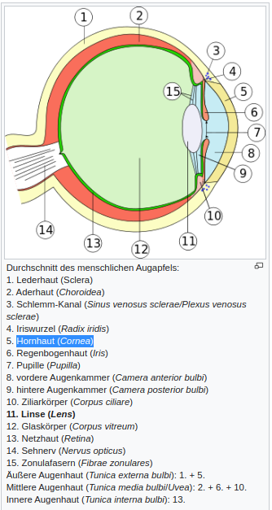
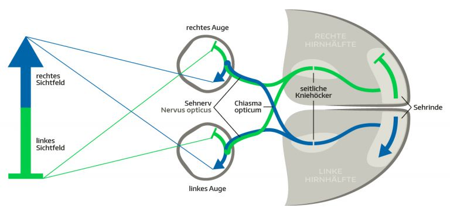
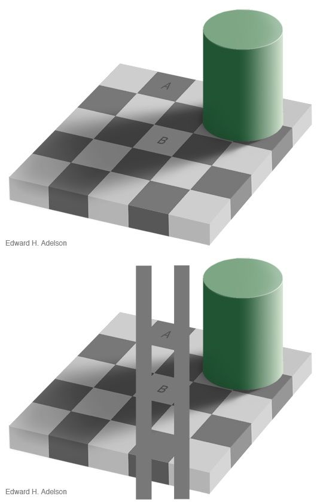

# Index

# Kapitel

## Kapitel 2 Wahrnehmung

* S. 17

### Kapitel 2 1. Psychophysik

* S. 18
* Psychophysik verwendet verschiedene Methoden um physikalische Zeire in
  quantitative Beziehung zur subjektiven Wahrnehmung zu setzen
  * S. 25
* Psychophysik spielt eine entscheidende Rolle an der Schnittstelle zwischen in
  der Informationstechnologie und menschlicher Wahrnehmung
  * S. 25

#### Kapitel 2 1.1 Sinnesmodlitäten & Wahrnehmungsspezifität

###### Sinnesmodalität

* Ein System, das aus verschiedenen Sinneseindrücken besteht
* S. 18

###### Wahrnehmungsspezifität

* Rezeptoren (z. B. bei Warnehmung von Licht) haben sich auf einen Sinn
  spezialisiert.
* Ein Schlaf auf das Auf löst visuelle Empfindungen aus.
* S. 18

#### 2.1.2 Methoden der Psychophysik

* Werden benutzt um quantitative Zusammenhänge zwischen phsysikalischem Reiz
  und bewusster Wahrnehmung zu erkennen

###### Absolutschwelle

* Kleinster Reiz, der wahrgenommen werden kann
* S. 19

###### Differenzschwelle

* Kleinster Unterschied zwischen zwei Reizen, der wahrgenommen werden kann
* S. 19

###### Methode der konstanten Reize

* Reize in unterschiedlicher Stärke in zufälliger Reihenfolge
* Versuchsperson muss angeben, ob sie den Reiz wahrgenommen hat oder nicht
* S. 19

###### Grenzmethode

* Reize in auf- oder absteigender Stärke
* Versuchsperson muss angeben, wann ein Reiz wahr- bzw nicht wahrgenommen
  werden kann
* S. 19

###### Herstellungsmethode

* Versuchsperson kann Stärke des Reizes selbst einstellen, sodass er gerade
  wahrnehmbar ist
* S. 19

###### Referenzreiz

* Um die Differenzschelle zu bestimmten, wird ein Referenzreiz benutzt
* S. 19

###### Psychometrische Funktion

* Beschreibt den Zusammenhang zwischen Stärke eines Reizes und die
  Wahrscheinlichkeit, dass dieser wahrgenommen werden kann
* S. 20

###### Wahrnehmungsschwelle

* Rezistörke, bei der eine Versuchsperson eine bestimmte Erkennungsleistung
  erreicht
* S. 20

###### Webersches Gesetz

* Die Unterscheidungsschwelle ΔS zweier Reize ist proportional zur Größe des
  Vergleichsreizes
* Formel: ΔS = k * S; k = Weberkonstante
* Weberkonstante: Wenn man einen Reiz um 10% erhhen muss, damit ein Unterschied
  wahrgenommen werden kann, muss man bei einem doppelt so starken Reiz auch das
  Doppelte verändern
* S. 21

###### Fechnersches Gesetz

* Empfindungsstärke E ist proportional zum natürlichen Logarithmus der
  Reizstärke S
* Formen: E = c * ln S (E = c * log10 S)
* Fechner-Konstante: Ähnlich wie die Weberkonstante, eine für jede
  Reizmodalität unterschiedliche Konstante
* S. 21f

###### Stevensches Gesetz

* Die Empfindungsstärke E ist eine Potenzfunktion der Reizstärke S
* Formel: E = b * S^a
* Stevens-Konstante: Ist a < 1, steigt die Empfindungsstärke mit zunehmender Reizstärke immer
  langsamer an, ist a > 1, dann immer stärker
  * Bsp 1: Jeder weiter Zuckerwürfel in ein Glas Wasser macht den Unterschied
    immer weniger spürbar
  * Bsp 2: Schmerzwahrnehmung bei elektrischen Schocks
* S. 22

#### Kapitel 2 1.3 Signalentdeckungstheorie

* Berücksichtigt im Gegensatz zu Psychophysik das Entscheidungsverhalten des
  Beobachters
  * Beobachter hat eigene Kriterien.
  * Wann die Empfindungsstärke das Kriterium übersteigt, entscheidet der
    Beobachter, dass ein Reiz wahrgenommen wurde
  * Der Beobachter kann richtug und falsch liegen
    * Richtig = Teffer
    * Falsch = Falscher Alarm
* Zitat aus Buch: "Der entscheidende Fortschritt der Signalentdeckungstheorie
  gegenüber früheren Verfahren ist daher, dass das tatsächliche
  Unterscheidungsvermögen des Beobachters (seine Sensivität) von seiner
  generellen Antwortneigung (englich: Response bias; strenges oder laxes
  Kriterium) getrennt werden kann"
* S. 22f

#### Kapitel 2 1.4 Entscheidungsmodelle und Criteion Content

* Criterion Content: Beschreibt die Information, die die Versuchsperson
  tatsächlich für ihre Entscheidung verwendet
  * Bsp: Ganzes Gesicht oder Mund-Ausschnitt für das Bestimmen von Emotionen
  * S. 24
* Eine psychophysische Aufgabe wird durch Entscheidungsmodell und Criterion
  Content charakterisiert
  * S. 25
  * Anmerkung: Entscheidungsmodell ist die gewählte Methode, s. o.

### Kapitel 2 2. Visuelle Wahrnehmung

* S. 25

###### Licht

* Ist elektromagnetische Strahlung im Wellenlängenbereich zwischen 400 und
  700nm.
* Entpsricht dem, was Menschen wahrnehmen können
* Geringe Wellenlänge: Blau
* Hohe Wellenlänge: Rot
* Gegenstände mit Farben reflektieren diese, alle anderen Werden absorbiert.
  Gleiches gilt für transparente Gegenstände, wie z. B. Glas
* S. 25

###### Augenflecken

* Sind direkt mit Forbewegungsmechnismen verschaltet
* Werden besser, wenn sie in einer Art Grube sind
* Werden besser, wenn man eine Linse hinzufügt
* S. 25

###### Auge - Optischer Apparat

* Netzhaut: Lichtsensitiver Teil
* Hornhaut (transparent)
* Iris
* Gallertartiger Glaskörper
* Photorezeptor
* S. 26

> Diese Datei ist unter der
> [Creative-Commons](https://en.wikipedia.org/wiki/de:Creative_Commons)-Lizenz
> [„Namensnennung – Weitergabe unter gleichen Bedingungen 3.0 nicht
> portiert“](https://creativecommons.org/licenses/by-sa/3.0/deed.de)
> lizenziert. 
> Urheber: [Talos](https://de.wikipedia.org/wiki/Benutzer:Talos),
> colorized by [Jakov](Jakov)

###### Linse

* Dicke wird durch Ringmuskel reguliert
  * Entspannen zieht die Linse flasch
  * Anspannen lässt die Linse dicker werden
  * S. 27

###### Akkomodation

* Ist das systematische Verstellen der Linse, je nach Entfernung des fixierten
  Objekts
* S. 28

###### Altersweitsichtigkeit / Presbyopie

* Ringmuskel viert an Spannung und Linse an Elastizität
* S. 28

#### Kapitel 2 2.2 Die Netzhaut

* S. 28

###### Photoelektrische Transduktion

* Ist die Umsetzung von Licht in ein elektrisches Signal in der Retina
* S. 28

##### Kapitel 2 2.2.1 Architektur der Netzhaut

* S. 29

###### Bipolarzellen

* Photorezeptoren sind über Bipolarzellen mit Ganglienzellen verbunden
* S. 29

###### Ganglienzellen

* Sind outputzellen
* Geben Informationen an das Gehirn weiter
* Sind viele Rezeptoren mit einer Ganglienzelle verbunden
  * hat das eine verstärkende Wirkung
  * trägt sie nicht sehr zum räumlichen Verständnis bei, weil sei einem großen
    Bereich abdeckt
* S. 29

###### Kompromiss zwischen Auflösung und Lichtempfinden
* @Konzept

* Zapfensystem: Hohes räumliches Auflösungsvermögen, benötigt ausreichend Licht
* Stäbchensystem: Geringes räumliches Auflösungsvermögen, benötigt wenig Licht
* S. 29

###### Blinder Fleck

* Axone der Ganglienzellen bilden Sehnerv, der das Augeverlässt. An dieser
  Stelle sind keine Photorezeptoren
* Fehlende Informationen werden durch jeweils anderes Auge ersetzt
* S. 29

###### Fovea centralis

* Bereich schärfsten sehens
* Hohe Konzentration an Zapfen
  * Zede Zapfenzelle ist mit genau einer Ganglienzelle verbunden
* S. 29

###### Konvergenzprinzip
* @Konzept

* Vom Zentrum (Fovea) zur Peripherie nimmt die Anzahl von Ganglienzellen ab und
  ist für immer mehr Photorezeptoren zuständig
  * Räumliches Auflösungsvermögen nimmt zur Peripherie ab
* Drei verschiedene Zapfentypen erlauben das Farbsehen
  * Sind in der Dunkelheit unbrauchbar
* Stäbchen kommen nicht in der Fovea vor, sind gleichmäßig verteilt und sind
  insgesamt mit weniger Ganglienzellen verbunden
  * Kann bereits schwache Lichtsignale entdecken
* S. 29

###### Hell- und Dunkeladaption

* Beschreibt das Wechseln von einem hellen in einen dunklen Raum (und vice
  versa)
  * Hell zu dunkel
    * Zuerst sieht man gar nichts
    * Biochemische Vorgängen in den Stäbchen müssen Sehfarbstoffe in den
      Ausgangszustand bringen
    * Während der ersten 5 Minuten ist das Zapfensehen für das Sehen
      verantwortlich
    * Dann kommt es zum Kohlrauschknickt, Stäbchen- sind ab diesem Zeitpunkt
      empfindlicher als Zapfensystem
    * Nach 30 Minuten ist die maximale Empindlichkeit erreicht
  * Dunkel zu hell
    * Man ist kurz geblendet
* Beide Systeme kalibrieren sich bei Aufenthalt in Wahrnehmungsumwelten, sie
  ermüden nicht
* S. 30

###### Kohlrausch-Knick

* Ist lediglich ein Zeitpunkt während der Dunkeladaption, bei dem die
  Empfindlichkeit des Stäbchensystems wieder die des Zapfensystems überholt
* S. 30

###### Adaption

* Wiederholte Reize mit gleichem Stimulus führen zu Abnahme der Reizantwort.
  Adaption ist die Neukalibrierung um das Wahrnehmungssystem auf
  Umweltgegebenheiten anzupassen.
* S. 30

#### Kapitel 2 2.3 Von der Netzhaut zum Gehirn

1. Elektrische Signale wandern über den Sehnerv in Richtung Gehirn
1. Kurz vor dem Gehirn verzweigen sich biede Sehnerven und bilden das **Chiasma
   Opticum**
1. Die wichtigste Komponente der Sehbahn verläuft über den im Thalamus
   liegenden **Kniehöcker (Corpus geniculatum laterale, CGL)** zum primären
   visuellen Kortex (V1) im Okzipitalkortex
1. Visuelle Signale werden im Areal V1 und in angrenzenden Arealen V2-V5 (V5 =
   mediotemporaler Kortex; MT) analysiert
1. Zwei Hauptpfade der visuellen Verarbeitung im Cortex
   1. Dorsal, zum Parietalcortex
   1. Ventral, zum Temporalcortex
   * Beide führen zum Frontalcortex
   * Frontalcortex ist für komplexe Entscheidungsvorgänge und
     Handslungssteuerung zuständig
1. Ein weiterer Pfad von V1: Zum **Colliculus superior**, das visuelle Zentrum
   des Mittelhirns
   * Wichtig bei Umsetzung visueller Informationen in Blick- und
     Orientierungsbewegungen
1. Das linke CGL erhält Informationen aus rechtem Auge und vice versa
  * Im visuellen Kortex werden Informationen kombiniert
  * Jede Gehirnhälfte bleibt zuständig für Informationen aus dem
    gegenüberliegenden (kontralateralen) Feld
* S. 33

###### Chiasma Opticum

* Stelle der Verzweigung der Sehnerven
* S. 33

###### Kniehöcker (CGL, Corpus geniculatum laterale)

* Liegt im Thalamus
* Projiziert zu V1
* S. 33

###### Collicullus superior

* Im Mittelhirn
* Wichtig bei Umsetzung visueller Informationen in Blick- und
  Orientierungsbewegungen
* S. 33

#### Kapitel 2 2.4 Grundprinzipien der visuellen Verarbeitung

* S. 34

###### Konvergenz & Divergenz

* Es gibt mehr Photorezeptorzellen als Fasern im Sehnerv, deswegen gibt es die
  "konvergente Verschaltung"
* **Konvergente Verschiegung**: Eine kortikale Zelle ist für einen ganzen
  Ausschnitt verantwortlich
  * Mehrere Signale werden auf einer kortikalen Zelle zusammengeführt
* **Rezeptives Feld**: Ist das visuelle Feld, für das eine kortikale Zelle
  verantwortliche ist (s. o.)
* **Divergente Verarbeitungs**: Es gibt viel mehr Zellen, die für die
  Verarbeitung jedes bestimmten rezeptiven Felds. 
  * Die Verarbeitung eines rezeptiven Felds wird geteilt und in mehreren
    kortikalen Neuronen durchgeführt
* S. 34

###### Multiple Karten des visuellen Felds

* Jeder Bereich der Retine hat einen entsprechenden Bereich im CGL, im primären
  visuellen Kortex und in den höheren visuellen Arealen
* Benachbarte Bereiche der Retina sind auch an den anderen Orten benachbart,
  woraus eine Karte entsteht: **retinotope Karte**
  * Jede Karte ist auf eine Reizeigenschaft spezialisiert, z. B. Farbe, Form,
    Tiefe oder Bewegung
* S. 34

###### Spezialisierte Verarbeitungspfade

* Der **ventrale Verarbeitungspfad** über den Temporallappen
  * Ist für Objekterkennung und Aufbau einer bewussten Repräsentation der Welt
    zuständig
* Der **dorsale Verarbeitungspfad** über den Parietallappen
  * Ist für Lokalisation von Reizen - vor allem relativ zum Körper -
    spezialisiert.
  * Ermöglicht schnelles Übersetzen visueller Informationen in gezielte
    motorische Bewegungen
* S. 34

#### Kapitel 2 2.5 Konvergenz und Divergenz

* Rezeptive Felder retinaler Ganglienzellen:
  * sind kreisförmig
  * weisen eine Zentrum-Umfeld-Organisation auf
* **Klassisches rezeptives Feld**: Ausschnitt der für die Erregung sorgt
* **Modernes rezeptives Feld**: Außerdem genaue Reizeigenschaften und Reize
  außerhalb d. klassischen Felds, die Verarbeitungseigenschaften der Zelle
  beeinflussen können
* S. 34

###### On-Center und Off-Center-Zellen

* Hälfte der Ganglienzellen sind On-Center
* On-Center-Zellen
  * werden erregt, wenn Licht ins Zentrum eines rezeptiven Felds fällt
  * werden gehemmt, wenn das Licht ins Umfeld fällt
* Off-Center-Zellen
  * werden erregt, wenn Lichts in Umfeld fällt
  * werden gehemmt, wenn Licht ins Zentrum eines rezeptiven Felds fällt
* Ein gleichzeitiges Belichten des Zentrums und Umfelds löst höchstens eine
  minimale Erregung aus, da Erregung und Hemmung sich aufheben
* Größe von Zentrum und Umfeld:
  * Durchmesser der Feldzentren sind einige Bogenminuten
  * In der Peripherie 3-5 Grad Sehwinkel
* Die Zentrumumfeld-Struktur der Ganglienzellen dient der Verstärkung von
  lokalen Bildkontrasten.
  * Benachbarte Ganglienzellen hemmen sich gegenseitig
* S. 35

###### Sehwinkel & Bogenminuten

* 1 Grad Sehwinkel in Relation zur Retina ist in etwa die Breite des
  Zeigefingers in Relation zur Armlänge
* 1 Grad sind 60 Bogenminuten
* S. 35

###### Laterale Hemmung

* Die laterale Hemmung bezeichnet ein allgemeines Verschaltungsprinzip im
  Gehirn
  * Nach diesem hemmen sich benachbarte Zellen oder Zellen mit ähnlichen
    Verarbeitungseigenschaften wechselseitig
  * Es dient der Verstärkung von lokalen Kontrasten
    * Weil die wiederholte Brechung und Streuung des Lichts im optischen
      Apparat alle Objekte nur unscharf projiziert werden können
S. 35

###### Der kortikale Vergrößerungsfaktor

* Das Missverhältnis der Repräsentation von Fovea und Peripherie ist notwendig,
  da eine gleichmäßige Repräsentation einen riesigen Kortex benötigen würde
  * Ein hochauflösendes Bild konzentriert sich auf einem kleinen Bereich
  * Durch ein komplexes System auf Kopf- und Augenbewegungen kann trotzdem
    jeder Teil des sichbaren Bereichs analysiert werden
* S. 36

###### Rezeptive Felder im primären visuellen Komplex (V1)

* In V1 antworten die Neurone nur schwach / nicht auf punktförmige Lichtreize
  * Sie reagieren allerdings sehr stark auf kurze Lichtstreifen
* S. 37

* Es gibt 3 Typen von Neuronen
  1. Einfache Zelle
    * Besitzen längliche rezeptive Felder mit einer erregenden Zone in der
      Mitte und flankierenden hemmenden Zonen
    * **Tuning-Kurve** der Zelle: Je besser die Orientierung des Reizes der
      Orientierung des rezeptiven Feldes entspricht, desto stärker fällt die
      Antwort der Zelle aus
    * Entstehen durch eine einfache Zusammenschaltung rinförmiger rezeptiver
      Felder
    * S. 37
  2. Komplexe Zellen
    * Reagieren selektiv auf Reize einer bestimmten Orientierung
    * Lage der rezeptiven Felder ist irrelevant (müssen also nicht orientiert
      sein)
    * Entstehen durch einfache Zusammenschaltung einfacher Zellen (s. o.) mit
      gemeinsamer Orientierung
    * S. 38
  3. Endinhibierte bzw. hyperkomplexe Zellen
    * Antworten auf Streifen, Ecken oder Winkel einer bestimmten Länge, die
      sich in einer bestimmten Richtung über ihr rezeptives Feld bewegen
    * S. 38

##### Kapitel 2 2.5.1 Die Organisation von V1: Windmühlen und Eiswürfel

###### Orientierungssäulen

* Der primäre visuelle Kortex besteht aus sechs Schichten
  * Eine ist die **Eingangsschicht**
  * Eine ist die **Ausgangsschicht**
* Übereinanderliegende Zellen der Schichten haben die selben rezeptiven Felder
  * Sie besitzen ähnliche Orientierungsselektivität
  * Wird Orientierungssäule genannt
* Neveneinanderliegende Orientierungssäulen sind für ähnliche Orientierung
  zuständig
* Haben eine regelmäßige windmühlenartige Anordung um ein in der Mitte
  liegendes Zentrum
* **Augendominanzsäulen**: Etwa die Hälfte der Neurone haben eine deutliche
  Präferenz für das linke oder rechte Auge
* S. 38

###### Eiswürfelmodell

* Spezialisierte Säulensysteme ergeben eine einfache, bauklotzartige Struktur
  * Diese wird Eiswürfelmodell genannt
* Nach diesem Modell kann man den V1 in Hypersäulen unterteilen
  * Hypersäulen esteht aus zwei Augendominanzsäulen, für jeweils links und
    rechts
    * Enthalten jeweils einen vollständigen Satz an Orientierungssäulen
      (Windmühlenflügel für alle möglichen Richtungen)
  * Ist ein kleineres Verarbeitungsmodul, das für einen bestimmten Ausschnitt
    des visuellen Felds verantwortlich ist
  * Hat die Kapazität, die Orientierung und Bewegungsrichtung einer Kontur in
    diesem kleinen Bildausschnitt zu bestimmen
* S. 38

#### Kapitel 2 2.6 Multiple Karten des visuellen Felds

* S. 39

##### Kapitel 2 2.6.1 Gehirn als Atlas

* S. 39

###### Retinotope Karten

* Benachbarte Ganglienzellen haben stark überlappende rezeptiver Felder
  * Diese projizieren an benachbarte Zellen im CGL
  * Abbildung ist retinotop -> stellt eine räumliche Abbildung des optischen
    Bilds auf der Retina dar
* S. 39

###### Konturen und Scheinkonturen

* Verarbeitung vn Form, Bewegung und Farbe wird in V2 und V3 fortgesetzt
* in V2: Hat die ersten Zellen, die sowohl auf echte, als auch auf
  Scheinkontueren reagieren
  * Konturen verschiedener Strukturen könenn zu einer gemeinsamen Kontaktlinie
    zusammengefasst und sinnvoll forgesetzt werden
* S. 39

###### Die Areale V4 und MT (V5)

* V4 spielt eine entscheidende Rolle bei der Wahrnehmung von Formen und Farben
  * Enthält viele farb- und orientierungsspezifische Zellen, die zum Teil
    selektiv auf komplexe geometrische Muster ansprechen
* V5: @TODO(missing): In Notizen steht nichts über V5/MT an dieser Stelle
* S. 40

##### Kapitel 2 2.6.2 Rekurrente Verarbeitung
* S. 40

###### Netzwerke von Arealen (V1, V2, etc)

* Verarbeitung über mehrere Areale ist nicht unidirektional
  * Informationen werden vorwärts ("**feedforward**") und rückwärts
    ("**feedback**") geschickt
  * Sorgt für Verarbeitungsschleifen (= rekurrente Verarbeitungsschleifen)
* Verarbeitungsschleifen sorgen dafür, dass komplexe Informationen schnell den
  anderen Arealen ebenfalls zur Verfügung stellen
* V1 ist eine Art Verteilerstation, die die Informationen der anderen Areale
  Zusammenfasst und weitergibt
* S. 40

###### Änderung von Verarbeitungseigenschaften über Zeit

* Zellen des primären visuellen Kortex können ihre Kodierungseigenschaften
  ändern, schon während sie noch dabei sind auf einen Reiz zu reagieren
  * Wenn eine Zelle in V1 auf einen bestimmten Reiz zu reagieren beginne, hängt
    die Reaktion nur von der Orientierung ab
  * Nach 100ms hängt die Reaktion auch davon ab, ob der Reiz Teil einer Figur
    oder Teil eines Hintergrunds ist
* Diese Informationen bekommt V1 von den höheren Arealen
* S. 41

###### Fazit

* Die Karten sind durch rekurrente Beziehungen verknüpft und tauschen ständig
  Informationen aus, sodass dieselben Zellen zu unterschiedlichen Zeitpunkten
  der Verarbeitung unterschiedliche Funktionen übernehmen können
* S. 41

#### Kapitel 2 2.7 Spezialisierte Verarbeitungspfade

##### Kapitel 2 2.7.1 Cirpus geniculatum laterale (CGL)

###### Die wichtigsten Nervenbahnen

* Signalweitergabe vom CGL zum V1, aber auch von V1 zum Thalamus
  * Auch hier bilden sich rekurrente Verarbeitungsschleifen
* Der Thalamus projiziert zum Rückenmark, Hirnstamm, Kleinhirn und weiteren
  Arealen
  * Thalamus spielt eine wichtige Rolle bei Aufmerksamkeitsregulierungen und
    der Integration von Informationen verschiedener Sinnesmodalitäten
* S. 41

###### Magno-, Parvo-, M- & P-Zellen

* CGL besteht aus 6 schichten
  * 3 für jedes Auge
* Jede Schicht hat eine vollständige retinotope Karte
  * Alle Karten passen genau übereinander
* Die relativ großen Zellen der beiden inneren Schichten werden
  **Magno-Zellen** genannt
* Die kleineren Zellen der äußeren Schichten werden **Parvo-Zellen** genannt
* Eine entsprechende Unterscheidung findet sich bereits in der Retina
  * Dort gibt es **M-** und **P-Zellen**
* **M-** und **Magno-Zellen**
  * weisen große rezeptive Felder auf
  * sind nahezu farbunempfindlich
  * liefern schnelle, kurz anhaltende Signale, die wichtig für die Analyse
    visueller Bewegungsinformationen sind
* **P-** und **Parvo-Zellen**
  * Haben eine entscheidende Rolle beim hochauflösenden Sehen von Form & Farbe
* S. 41f

##### Kapitel 2 2.7.2 Dorsaler und ventraler Strom: Haben wir 2 visuelle Systeme?

* S. 42

###### Separate Verarbeitungsströme

* Existenz zweier visueller Verarbeitungsströme mit unterschiedlichen
  Funktionen ist heute weitergehend unstrittig
* Der ventrale Strom ("Was-Pfad") ist für die Erkennung von visuellen Objekten
  zuständig
* Der dorsale Pfad ("Wo-Pfad") ist für die Lokalisation von Objekten zuständig
* Dorsaler und ventraler Pfad sind nicht komplett unabhängig, da sie auf
  gemeinsame Areale zurückgreifen (S. 43)
* S. 42

###### Der ventrale Strom

* Der ventrale Strom ("Was-Pfad") ist für die Erkennung von visuellen Objekten
  zuständig
* Von V1 über V4 in den Temporallappen
* Entlang des Pfades werden die rezeptiven Felder immer größer
  * Die Zellen am Ende reagieren auf Gesichter oder Gebäude
    * Manche Zellen sind so spezialisiert, dass sie nur auf bestimmte Gesichter
      reagieren
  * Ist mit dem Hippocampus verknüpft, das für das Einspeichern von
    Informationen ins Langzeitgedächtnis verantwortlich ist
* S. 42

###### Der ventrale Strom

* Der ventrale Strom ("Was-Pfad") ist für die Erkennung von visuellen Objekten
  zuständig
* Von V1 über V4 in den Temporallappen
* Entlang des Pfades werden die rezeptiven Felder immer größer
  * Die Zellen am Ende reagieren auf Gesichter oder Gebäude
    * Manche Zellen sind so spezialisiert, dass sie nur auf bestimmte Gesichter
      reagieren
  * Ist mit dem Hippocampus verknüpft, das für das Einspeichern von
    Informationen ins Langzeitgedächtnis verantwortlich ist
* S. 42

###### Der dorsale Strom

* Der dorsale Pfad ("Wo-Pfad") ist für die Lokalisation von Objekten zuständig
* Ist damit beschäftigt, die Position von Reizen in verschiedenen räumlichen
  Referenzsystemen auszudrücken
  * z. B. relativ zur Hand, Kopfrichtung oder Blickachse
* Wertet visuelle Informationen aus, um visuell geleitete Körperbewegungen zu
  steuern
  * Da Reize in Relation zu Teilen des Körpers gesetzt werden, deren POsition
    sich aber ständig ändern
    * Muss schneller als der verntrale Strom sein, da visuelle Reize praktisch
      in "Echtzeit" verarbeitet werden müssen
  * Das Ergebnis ist das morotische Handeln
* S. 42f

###### Doppeldissoziation

* Läsionen des ventralen Stroms können zu Agnosie führen
  * Unfähigkeit bestimmte Objekte zu erkennen ("**Prosopagnosie**")
  * Verlust des Farbensehens ("**cerebrale Achromatopsie**")
* Lösionen des dorsalen Stroms führen zu Einschränkungen bei komplexen
  visomotorischen Ausührungen
  * z. B. zielgerichtetes Zeigen, Kontrolle von Körperorientierung im Raum oder
    effizientes Greifen von Gegenständen ("**optische Ataxie**")
* S. 43

###### Fallbeispiel: Patientin D. F.

* Schäden im ventralen Strom durch Kohlenmonoxidvergiftung
* Hatte **Objekterkennungsagnosie**: War nicht in der Lage Objekte zu
  identifizieren oder zu beschreiben
  * Konnte Orientierung eines drehbaren Briefschlitzes nicht angeben. Weder
    verbal noch pantomimisch
* Spontane visomotische Fähigkeiten warn intakt
  * Sie onnte spontan und fehlerfrei einen Bried in den Briefschlitz stecken
* Patienten mit Läsionen am dorsalen Pfad haben das umgekehrte Problem
  * Können Orientierung des Briefschlitzes perfekt beschreiben.
  * Es braucht mehrere Versuche um den Brief einzustecken
* S. 44

#### Kapitel 2 2.8 Spezifische Wahrnehmungsleistung

* S. 45

##### Kapitel 2 2.8.1 Helligkeit

###### Physikalische Größen: Illuminanz, Luminanz, Reflektanz

* **Illuminanz (I)**: Intensität des Lichts, welches auf ein Objekt trifft
* **Luminanz (L)**: Lichtmenge, die nach der Reflektion des Objekts das Auge
  erreicht
* **Reflektanz (R)**: Der Prozentsatz des einfallenden Lichts, das von der
  Oberfläche des Objekts reflektiert wird
* **Formel**: L = I * R
* S. 45

###### Psychologische Größen: Lightness und Brightness

* **Brightness**: Wahrgenommene Luminanz einer Oberfläche
* **Lightness**: Wahrgenommene Reflektanz einer Oberfläche
* S. 45

###### Helligkeitskonstanz

* Ist die Wahrnehmung gleichbleibender Lightness trotz wechselnder Beleuchtung
* **Adelsons Schachbrett-Illusion**
  * Schachbrett (5x5) mit Zylinder, der auf einem Bereich des Bretts einen
    Schatten wirft
  * Alle schwarzen bzw. weißen Felder haben die gleiche Reflektanz
    * = den gleichen Farbton
  * Im Schatten des Zylinders ist die Illuminanz geringer
  * Die im Schatten liegenden Kacheln scheinen dennoch die gleiche Farbe wie
    die nicht im Schatten liegenden Farben zu haben
    * Die im Schatten liegenden Felder haben eine andere Brightness, aber die
      selbe Lightniss
    * Die tatsächliche Luminanz der weißen Felder im Schatten etnspricht der
      der schwarzen Fehlder außerhalb des Schattens
  * Illusion beruht darauf, dass das visuelle System das von der Überfläche
    eintreffende Licht nicht als absolute Größe interpretiert
    * sondern relativ zu den im Reiz erkennbaren Beleuchtungsverhältnissen
* S. 46

###### Transparenzwahrnehmung

* Transparente Flächen wirken als Filter, die unterschiedliche Lichtmengen
  durchlassen
  * Das hidurchtretende Licht ist ein Kompromiss zwischen der ursprünglichen
    Lichtquelle und dem Transparenzfilter
* Ein dunkler Filter reduziert die Luminanz aller Lichter um einen konstanten
  Wert (z. B. 50%; z. B. eine Sonnenbrille)
* Ein heller Filter komprimiert die Spannweite der Liminanz ebenfalls
  * Zusätzlich hebt er dunkle Luminanzen an, weswegen schwarze Flächen grau
    erscheinen
* S: 47

###### Kontrast

* Beruht auf dem Verhältnis von Luminanz
* Ein dunkler Filter verringert alle Luminanzen, aber der Kontrast bleibt
  gleicht
* Sonnenschein erzeigt einen höheren Kontrast als Mondliche
* S. 48

##### Kapitel 2 2.8.2 Farbe

###### Absorptionsspektren

* Retine besitzt drei Arten von Zapfen
  * Reagieren auf unterschiedliche Wellenlängen-Bereiche
    * = Ihr **Absorptionsspektrum**
* **K-Zapfen**/**S-Zapfen**: Reagueren auf kurz-welliges Licht
  * K = kurz, S = short
* **M- & L-Zapfen**: mittel- und langweilliges Licht
* Die Absorptionsspektren überlappen stark
  * Vor allem die der M- und L-Zapfen
* S. 49

###### Univarianzprinzip

* Wir können so viele Farben unterscheiden, wie wir Aktibitätsmuster der K-, M-
  und L-Zapfen auseianderhalten können
  * z. B. Aktivität im Verhältnis 4:2:1 oder 1:3:4
* Führen zwei physikalisch unterschiedliche Lichtmischungen zum selben
  Aktivitätsmuster, z. B. 1:3:2, sehen die Lichter farblich identisch aus
  * **metamere Farben**
* Gilt nur für isolierte Farbreize unter konstanten Sichtbedingungen
* S. 49

###### Konkurrierende Theorien

* Thomas Young & Hermann von Helmholtz: Zur Mischung einer Farbe aus dem
  Lichtspektrum benötigt man im Allgemeinen drei Farben verschiedener
  Wellenlängen
  * Führte zur Idee, dass Farbwahrnehmumg auf drei unterschiedlichen
    Rezeptortypen basieren könnte
* Ewald Hering: Es gebe drei Gegenfarb-Mechanismen:
  * schwarz-weiß
  * rot-grün
  * blau-gelb
  * reagieren auf die jeweils entgegengesetzt auf Licht unterschiedlicher
    Intensität und Wellenlänge
* S. 50

###### Gegenfarbkanäle

* Man konnte die Absorptionsspektren der drei Sehfarbstoffe bestimmen
* Hering's Theorie nicht ganz richtig
  * Es gibt aber trotzdemGegenfarbkanäle auf der Ebene der Ganglienzellen der
    Retina
* Ganglienzellen unterscheiden sich darin, wie sie die Information aus den
  K-, M- und L-Zapfen verknüpfen
* Dabei ergeben sich drei Gegenfarbkanäle, die auch auf Ebene des CGL noch
  getrennt bleiben
* **Rot-Grün-Kanal**
  * vergleicht die Aktivität der Mittel- und Langwellen-Zapfen
  * **L minus M**
  * Aus dieser Differenz lässt sich ablesen, ob ein Reiz eher dem roten oder
    eher dem grünen Bereich des Lichtspektrums zuzuordnen ist
* **Blau-Geld-Kanal**
  * fasst die M- und L-Signale zusammen und vergleich diese durch
    Differenzbildung mit der Aktivität der K-Zapfen
  * **K minus (L plus M)**
  * So lässt sich ablesen, ob ein Reiz eher dem blauen oder dem gelben Bereich
    des Lichspektrums zuzuordnen ist
* **Hell-Dunkel-Kanal**
  * fasst die Signale der M- und L-Zapfen zusammen
  * **L plus M**
  * Maß für die wahrgenommene Helligkeit (Brightness) eines Reizes
* S. 50f

###### Wer kann welche Farben sehen?

* Unter den Säugetieren sind die Primaten die einzigen, die drei Zapfentypen
  haben
  * Evolutionärer Vorteil ist unklar
  * Es gibt einige Nicht-Säugetierarten, die drei Farbstoffe besitzen (z. B.
    Goldfisch)
* Rot-Grün-Blind: Ca. 2% aller Männer, ca. 0.4% aller Frauen
  * M- und L-Zapfen sitzen auf dem X-Chromosom, von dem Männer nur eines
    besitzen
* S. 51

###### Psychologie trifft Technologie: Farbräume und Farbtechnologien

* Die wichtigsten Beschreibungssysteme unterscheiden zwischen den drei
  Dimensionen Farbwert, Luminanz und Sättigung.
* **Farbwert**: Ist einfach die Lage der Farbe im Farbkreis (z. B. rot, grün,
  blau)
* **Luminanz**: Beschreibt die Intensität des farbigen Lichts
* **Sättigung**: beschreibt, wie stark der Anteil von weißen LIcht an der Farbe
  ist
* **Spektralfarbe**: enhält kein weißen Licht und hat maximale Sättigung
* **Pasteltöne**: haben einen hohen Anteil von weißem Licht und dadurch eine
  geringe Sättigung
* S. 51f
