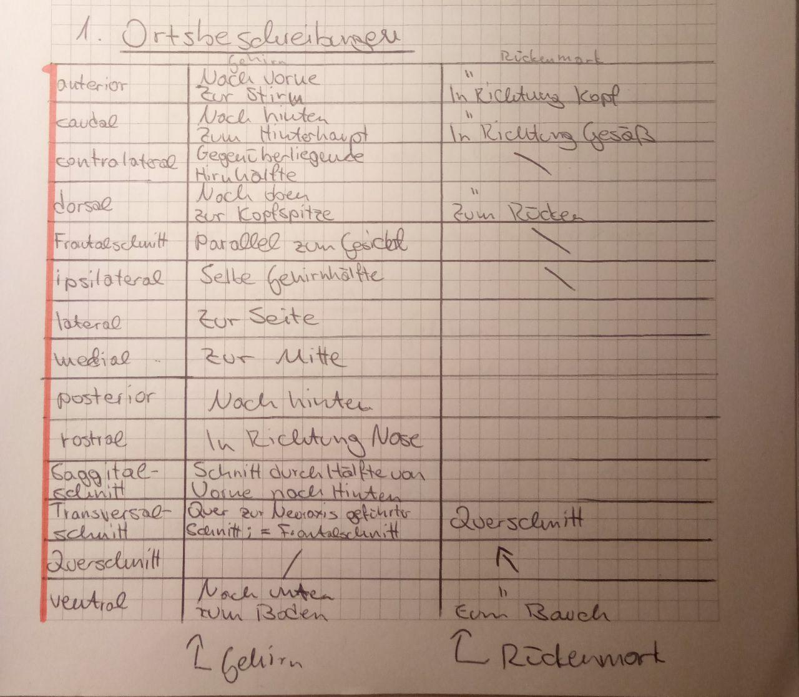

# Index

* [Kapitel 1](#kapitel-1)
  * [Gruppen](#kapitel-1-gruppen)
  * [Definitionen](#kapitel-1-definitionen)
* [Kapitel 2](#kapitel-2)
  * [Konzepte](#kapitel-2-konzepte)
  * [Gruppen](#kapitel-2-gruppen)
  * [Definitionen](#kapitel-2-definitionen)
* [Kapitel 3](#kapitel-3)
  * [Systeme](#kapitel-3-systeme)
  * [Konzepte](#kapitel-3-konzepte)
  * [Gruppen](#kapitel-3-gruppen)
  * [Definitionen](#kapitel-3-definitionen)
* [Kapitel 4](#kapitel-4)
  * [Kapitel 4 Komponenten des Gehirns](#kapitel-4-komponenten-des-gehirns)
  * [Kapitel 4 Ortsbeschreibungen](#kapitel-4-ortsbeschreibungen)
  * [Konzepte](#kapitel-4-konzepte)
  * [Gruppen](#kapitel-4-gruppen)
  * [Definitionen](#kapitel-4-definitionen)
* [Kapitel 5](#kapitel-5)
  * [Systeme](#kapitel-5-systeme)
  * [Konzepte](#kapitel-5-konzepte)
  * [Gruppen](#kapitel-5-gruppen)
  * [Definitionen](#kapitel-5-definitionen)
* [Kapitel 6](#kapitel-6)
  * [Konzepte](#kapitel-6-konzepte)
  * [Definitionen](#kapitel-6-definitionen)
* [Kapitel 7](#kapitel-7)
  * [Konzepte](#kapitel-7-konzepte)
  * [Gruppen](#kapitel-7-gruppen)
  * [Definitionen](#kapitel-7-definitionen)
* [Kapitel 8](#kapitel-8)
  * [Systeme](#kapitel-8-systeme)
  * [Konzepte](#kapitel-8-konzepte)
  * [Gruppen](#kapitel-8-gruppen)
  * [Definitionen](#kapitel-8-definitionen)
* [Kapitel 9](#kapitel-9)
  * [Systeme](#kapitel-9-systeme)
  * [Konzepte](#kapitel-9-konzepte)
  * [Definitionen](#kapitel-9-definitionen)
* [Kapitel 10](#kapitel-10)
  * [Systeme](#kapitel-10-systeme)
  * [Konzepte](#kapitel-10-konzepte)
  * [Definitionen](#kapitel-10-definitionen)
* [Kapitel 11](#kapitel-11)
  * [Systeme](#kapitel-11-systeme)
  * [Konzepte](#kapitel-11-konzepte)
  * [Gruppen](#kapitel-11-gruppen)
  * [Definitionen](#kapitel-11-definitionen)
* [Kapitel 12](#kapitel-12)
  * [Konzepte](#kapitel-12-konzepte)
  * [Forschungsergebnisse](#kapitel-12-forschungsergebnisse)
  * [Definitionen](#kapitel-12-definitionen)

# Kapitel

## Kapitel 1

### Kapitel 1 Gruppen

* Mikroglia

### Kapitel 1 Definitionen

* Astroglia

  * Verbindet Neurone mit Kapillaren der Blutversorgung
  * Versorgt Neurone mit Nährstoffen
  * Entsorgt Abfallstoffe der Neurone

* Axon
* Dendrit
* Dornen
* Gliazellen
* Golgi-Technik

  * Imprägniert Gewebeschnittstelle mit Silbernitrat

* Mikroglia

  * Verdaut tote und sterbende Neurone
  * Immunsystem des Gehirns

* Myelinscheiden
* Oligodendrozyt / Oligodendroglia

  * Bildet Fortsätze die sich um Axone der Neurone zur myelinisierung wickeln
  * Im Gehirn / ZNS

* Postsynapse
* Präsynapse
* Purjekinzellen

  * Neurone, die einlaufende Informationen integrieren und anschließend motirische Koordinierungsbefehle zu Strukturen außerhalb der Kleinhirnrinde schicken

* Schwann'sche Zellen

  * Bildet Fortsätze die sich um Axone der Neurone zur myelinisierung wickeln
  * Im Rückenmark / PNS

* Soma

  * Zellkörper eines Neurons

* Synapse
* Synaptischer Spalt

## Kapitel 2

### Kapitel 2 Konzepte

* Aktionspotenzial: Entstehung & Verlauf
  * Postsynapitsche Depolarisation schickt AP der vorherigen Zelle durch Dendriten, dann das Soma bis zum Axonhügel
  * Wenn dort der Schwellenwert der Ladung überschritten wird, öffnen sich Na+ Kanäle, die den Axonhügel weiter depolarisieren
  * Entlang des Axons befinden sich Na+ Kanäle, die durch die räumlich vorhergehenden benachbarten Ort depolarisiert werden und ebenfalls öffnen
  * Dadurch wird das AP bis zur Synapse befördert
  * Außerdem öffnen sich spannungsabhängige K+ Kanäle, durch die die Zelle repolarisiert wird, bis zur Hyperpolarisation
  * Bis die Hyperpolarisation erreicht ist, können die Na+ Kanäle nicht erneut aktiviert werden, sie befinden sich in der Refraktärzeit

### Kapitel 2 Gruppen

* Ionen
* Ionenkanäle (Schwellenwert)

### Kapitel 2 Definitionen

* Aktionspotenzial
* Depolarisation
* Elektrostatische Kraft
* Hyperpolarisation
* Ion Chlorid
* Ion Eiweiß
* Ion Kalium
* Ion Natrium
* Ion: Calcium
* Ionenkanal Kalium
* Ionenkanal Natrium
* Ionenkanal Natrium-Kalium-Pumpe
* Konzentrationsgradient
* Membranpotenzial
* Myelinisierte Axone
* Rannvier'sche Schnürrringe
* Refraktärzeit
* Ruhepotenzial
* Tetrodotoxin
* Zellmembran

## Kapitel 3

### Kapitel 3 Konzepte

* Biochemische Kaskade der Metabotrope Rezeptoren
  * Öffnen nicht direkt Ionenkanäle
  * Ablauf
    1. Bindungen des Transmitters (oder Hormons) an den Rezeptor
    2. Aktivierung eines sich in der Nähe befindenden G-Proteins
    3. Eine Alpha-Untereinheitspaltet sich vom G-Protein ab
    4. Die Alpha-Untereinheit aktiviert ein Einzym
    5. Das Enzym synthetisiert einen sekundären Botenstoff (z. B. cAMP)
  * Dadurch
    * können Ionen-Kanäle geöffnet werden
    * kann in das Genom eingegriffen werden um Proteine herzustellen
      * -> Kann eine potenziell Lebenslange veränderung hervorrufen

* Nucleus Basalis von Meynert & Acetylcholin
  * Acetylcholin kommt in hohen Mengen im PMT vor
  * Stabilisieren Lernprozesse, die sich im Cortex ereignet habe

* PMT & Acetylcholin
  * Acetylcholin kommt in hohen Mengen im PMT vor
  * Übermitteln spezifische sensorische Informationen an Cortex
    * Kann Aufmerksamkeitsverschiebungen des sensorischen Systems bewirken

* Summation postsynaptischer Potenziale
  * Zeitlich: Aufeinanderfolgende einkommende Signale werden summiert
  * Räumlich: Räumlich nah beieinanderliegende Signale werden summiert
  * EPSPs und IPSPs verrechnen sich

* VTA & Dopamin
  * Teil des Belohnungssystems
  * VTA hat die größte Konzentration an Dopamin im Gehirn

* Vesikel: Unterschied hell & dunkel
  * Helle Vesikel enthalten nicht-peptiterge Neurotransmitter
  * Dunkle Vesikel enthalten peptiterge Neurotransmitter

* Übertragung eines Aktionspotenzials an der Synapse
  * AP trifft an der Präsynapse ein
  * Öffnet Ca2+ Kanäle (Calcium), welche die Präsynapse depolarisiert
  * Sorgt dafür, dass sich die Proteinbrücke der Vesikel in Wartehaltung öffnen
  * Dadurch gelangen Neurotransmitter in den synaptischen Spalt
  * Neurotransmitter wandern durch den synaptischen Spalt zur Postsynapse
  * Je nach Neurotransmitter kommt es an der Postsynapse zu einem EPSP oder IPSP

### Kapitel 3 Gruppen

* Neurotransmitter
* Neurotransmitter-Gruppen
* Rezeptor-Arten (iono- & metabotrop)
* Rezeptoren

### Kapitel 3 Definitionen

* Alzheimer-Demenz
  * Bei der Alzheimer'schen Demenz kommt es zu einem bedeutenden Zelltod
    acetylcholingerer Interneurone und ein Teil der resultierenden kognitiven
    Defizite geht auf das Sterben dieser Neurone zurück
  * S. 64
* Bahn: Mesocorticale
  * Verbindet das VTA mit dem PFC
  * 1 von 4 Haupt-Dopaminbahnen
* Bahn: Mesolimbische
  * Im häufig benutztem engeren Sinne jedoch ist mit dem Ausdruck nur der Teil gemeint, der das Zentrum des Belohnungssystems im Gehirn der Säugetiere ausmacht.
* Bahn: Nigrostiatale
  * Komponente des Systems der Basalganglien ist. Die Nigrostriatalbahn benutzt Dopamin als Neurotransmitter
  * Wichtig für Willkürmotorik
* Botunilumtoxin
* Exzitatorisches postsynaptisches Potenzial (EPSP)
  * Depolarisierendes Potenzial
* Inhibitorisches postsynaptisches Potenzial (IPSP)
  * Hemmendes Potenzial
* Interneurone
  * Acetylcholinerges Interneuron:
    * Konzentrieren sich auf 2 Kerne des Gehirns, einer ist Nucleus Basalis
    * Projizieren mit langen Fastertrakten in fast alle Bereiche des Gehirns
* Neurotransmitter: Acetylcholin
* Neurotransmitter: Dopamin
  * Ist ein Amin (Katecholamin)
* Neurotransmitter: Exzitatorisch
* Neurotransmitter: GABA-a
* Neurotransmitter: GABA-b
* Neurotransmitter: Glutamat
* Neurotransmitter: Inhibitorisch
* Neurotransmitter: Oxytocin
* Nucleus Basalis von Meynert
  * Produziert Acetylcholin
  * Befindet sich im frontalen, basalen Telencephalon
    * In etwa zwischen der Amygdala und dem Globus pallidus
  * Projiziert in das limbische System und die gesamten Cortex
  * Acetylcholinerge Interneurone projizieren von hier in die gesamte
    Großhirnrinde und stabilisieren Lernprozesse
* Pontomesencephalotegmentaler Komplex (PMT)
  * Auch "Pontines Tegmentum"
  * Die Mittelhirnhaube (Tegmentum mesencephali) ist der größte Teil des Mittelhirns und besteht aus weißer und grauer Substanz. 
* Rezeptor: Ampa
  * Sind überall im Gehirn
  * Lassen bei Aktivierung Na+ einströmen
  * Öffnen & schließen sehr schnell
* Rezeptor: Dopamin (D1 - D5)
* Rezeptor: Ionotrop
  * Öffnen wenn Neurotransmitter andockt und lassen Ionen durch
* Rezeptor: Kainat
  * Sind überall im Gehirn
  * Lassen bei Aktivierung Na+ einströmen
  * Öffnen & schließen sehr schnell
* Rezeptor: Metabotrop
  * Sind langsamer als ionotrope Rezeptoren
  * Können deutlich stärkeren Effekt haben
  * Siehe: Konzept -> "Biochemische Kaskade der Metabotrope Rezeptoren"
* Rezeptor: Muscarinerg (M1 & M2)
  * Werden durch Acetylcholin geöffnet
  * 5 Typen, die in 2 Gruppen unterteilt werden: M1 & M2
    * Je nach dem welcher Rezeptor auf welchem Zelltyp sitzt, kann die Wirkung
      exzitatorisch/depolarisierend bzw. inhibitorisch/hyperpolarisierend sein
* Rezeptor: NMDA
  * Für Beispiel, siehe Kapitel 7 Konzept: "Konsolidierung einer Gedächtnisspur mit NMDA-Rezeptoren"
* Rezeptor: Nikotinischer
  * Werden durch Acetylcholin geöffnet
  * Sind ionotrop
* Schwellenwert (zur Öffnung von Ionenkanälen)
* Vesikel
* Vesikel-Wartehaltung
* Willkürmotorik
  * Vom Bewusstsein gesteuerte und ausgelöste Bewegungsabläufe bezeichnet.

## Kapitel 4

### Kapitel 4 Komponenten des Gehirns

(S.73)

* Prosencephalon
  * **<ins>Telencephalon</ins>** (Cerebrum)
    * **<ins>Pallium</ins>**:
      * umhüllt Subpallium
      * **Mediales Pallium**: **<ins>Hippocampus</ins>**
      * **Pallium laterales**: Gruppe kleiner Kerne
        * **<ins>Amygdala</ins>**
          * Größter Kern
          * **<ins>Putamen</ins>**
          * **<ins>Nucleus caudatus</ins>**
      * **Pallium dorsales**: **<ins>Cerebraler Cortex</ins>**
        * Sechs-schichtige Struktur
        * IV. Schicht: **<ins>Graue Substanz</ins>**
          * Darunter befindet sich eine dicke Schicht aus Axonen, die die
            verschiedenen Cortexareale verbindet
          * Viele Axone sind myelinisiert -> Wird **<ins>weiße Substanz</ins>**
            genannt
        * Wird in 4 topografische Loben unterteilt:
          * **<ins>Frontalcortex</ins>**
            * **<ins>Präfrontalcortex</ins>**
          * **<ins>Parietalcortex</ins>** / Scheitellappen
          * **<ins>Temporalcortex</ins>** / Seitenlappen
          * **<ins>Occipitalcortex</ins>** / Hinterhauptslappen
            * **<ins>Sulcus calcarinus</ins>**
              * **<ins>Primäres visuelles Areal</ins>**
    * **<ins>Subpallium</ins>**:
      * **<ins>Basalganglien</ins>** (2 Komponenten)
        * Speichern tausende Handlungsroutinen
        * Handlungsroutinen verdichten sich im Cortex durch den Kreislauf
          zwischen Cortex und den Basalganglien, die letztendlich Ausgeführt
          werden.
        * **<ins>Striatum</ins>**
          * **<ins>Nucleus accumbens</ins>**
          * Im ventralen Striatum zwischen Putamen und Nucleus caudatus
          * **<ins>Nucleus caudatus</ins>**
          * **<ins>Putamen</ins>**
            * Größter Teil der Interaktionen ist <ins>Kreislauf zwischen
              Basalganglien und Cortex</ins>
              1. Cortex
              1. -> Striatum
              1. -> Globus Pallidus
              1. -> Thalamus
              1. -> morotische Cortex Areale
          * Es gibt zahlreiche Brücken zwischen diesen beiden Strukturen
            * Zwischen den Brücken gibt es Millionen von Fasern, die den <ins>Cortex mit den tieferliegenden Strukturen des Gehirns
              verbinden</ins>
              * Bilden 2 Strukturen:
                * Aufsteigende und absteigende Fasern
          * Hat absteigende Projektionen an den Globus Pallidus
        * **<ins>Globus pallidus</ins>**
          * Hat absteigende Projektionen in den Hirnstamm
          * Koordiniert Bewegungsabläufe des Rumpfes
    * **<ins>Rhinencephalon</ins>** (Riechhirn)
      * Diese Verortung ist nicht im Lehrbuch; Seine Komponenten allerdings
        schon, weswegen ich ihn der Vollständigkeit halber in die Liste
        aufnehme
      * **<ins>Bulbus olfactorius</ins>** (Riechkolben)
        * Projiziert zum Cortex piriformis
        * **<ins>Glomeruli olfactorius</ins>**
      * **<ins>Cortex piriformis</ins>** (/ primärer olfaktorischer Cortex)
  * **<ins>Diencephalon</ins>** (Zwischenhirn)
    * Wird von dorsal (oben/Kopfspitze) nach ventral (unten/Boden) in 3
      Hauptbestandteile unterteilt:
    * **<ins>Epithalamus</ins>**
      * **<ins>Habenula</ins>** (Dach des Diencephalon)
        * Fast ein Dutzend (fast 12) kleine Kerne
        * Wirkung unbekannt
          * Man weiß, dass es Dopamin-Neurotransmitter hemmt, wenn Menschen
            nach einer fehlerhaften Reaktion negatives feedback erhalten
          * Könnte eine wichtige Rolle bei der Erzeugung neuronaler negativer
            Rückmeldung nach einem Fehler spielen
      * **<ins>Epiphyse</ins>** / Zirbeldrüse
        * Oberhalb der Habenula
          * Mit dieser durch einen langen, dünnen Stil verbunden
        * Schüttet Melatonin aus
          * Kann bei Säugetieren, im Gegensatz zu Amphibien und Reptilien, kein
            Tageslicht wahrnehmen
            * Muss über Projektionen des Auges über Tag/Nacht in Kenntnis
              gesetzt werden
    * **<ins>Thalamus</ins>**
      * Besteht aus einer Vielzahl von Kernen, die zum Cortex projizieren
        * Mit ausnahme des Geruchssinns besitzen alle sensorischen Systeme
          ihren eigenen Kern
        * Da diese Kerne an bestimmte sensorische Cortexareale projizieren,
          entsteht eine <ins>topographische Zuordnung zwischen sensorischen
          Thalamuskernen und sensorischen Cortexarealen</ins>
        * Haben immer eine Ansammlung hemmender Neurone in der Nähe
          * Können durch absteigende Projektionen des Cortex den Thalamus
            hemmen
        * Der Cortex kann ganze Kerne des Thalamus ausschalten und kann so
          kontrollieren, ob sensorische Informationen aus der Außenwelt
          zum Cortex aufsteigen oder nicht
      * **<ins>Pulvinar</ins>**
      * **<ins>GLd</ins>** (Nucleus geniculatus lateralis pars dorsalis)
    * **<ins>Hypothalamus</ins>**
      * Im ventralen Bereich des Diencephalons
      * Koordiniert viele Körperfunktionen, z. B. Temperaturkontrolle, Hunger,
        Durst, Sex, usw.
        * Werden in Regelkreisen des Hypothalamus koordiniert
      * Sielt eine wichtige Rolle bei der Regulation von Feedbackkreisen
      * **<ins>Hypophyse</ins>** (Hirnanhangdrüse)
        * Untere Hälfte wird **<ins>Adenohypophyse</ins>** genannt
        * Hinterer Teil heißt **<ins>Neurohypophyse</ins>**
          * Erhält direkt von Neuronen des Hypothalamus impulse
          * Produziert dann Hormone (Vasopressin oder Oxytocin)
          * Werden an das Kapillarnetz und dadurch direkt in den Blutkreislauf
            abgegeben
        * Großer Komplex für Erzeugung und Freisetzung von Hormonen
        * Erzeugung & Freisetzung von FSH (Follikelstimmulierendes Hormon)
          * Hypothalamus produziert GnRH
          * Wird vom hypophysären Pfortadersystem an die Adenohypophyse
            transportiert
          * Dort sitzen hormonproduzierende Zellen mit Rezeptoren für GnRH
          * Diese produzieren dann FSH
          * FSH wird in die Blutbahn abgegeben um zu den Eierstöcken bzw Hoden
            transportiert zu werden
* **<ins>Truncus cerebri</ins>** (Hirnstamm)
  * Fasertrakte fast aller Szsteme steigen durch den Hirnstamm auf
  * **<ins>Formatio Reticularis</ins>**
    * Durch die aufsteigenden Fastertrake fast aller Systeme, bekommt die
      Formatio Reticularis diffusen Eingang aller gerade ablaufender Prozesse
      * Wenn dort die Aktivität steigt, kommt es zu corticaler Erregung und
        einer extremen Wachheit, bei der auch schwache Reize wahrgenommen
        werden. 
        Bei sinkender Aktivität kommt es zum Schlaf und im Extremfällen zum
        Koma
    * Das **<ins>aufsteigende reticuläre Aktivierungssystem (ARAS)</ins>** wird mit der
      Aufmerksamkeitsleistung und der Vigilanz (Zustand andauernder
      Aufmerksamkeit bei eintöniger Reizfrequenz) von Menschen in Zusammenhang
      gebracht
    * Verläuft entlang der gesamten Längsausdehnung des Stammhirms
    * Die Formatio reticularis oder Retikulärformation bezeichnet ein ausgedehntes, diffuses Neuronennetzwerk im Hirnstamm, das von der Medulla oblongata (verlängertes Mark) bis zum Zwischenhirn (Diencephalon) reicht.
  * **<ins>Mesencephalon</ins>** (Mittelhirn)
    * **<ins>Tectum</ins>**
      * Im dorsalen Bereich des Mittelhirns
      * Besteht im wesentlichen aus der **<ins>Vierhügelplatte</ins>**
        * Die 2 oberen heißen **<ins>Colliculi superiores</ins>**
          * Bekommen direkte Eingänge aus der Retina
          * Neurone kontrollieren Reflexbewebungen der Augen
          * Umfasst viele Aspekte bei denen AUgen und Hände Koordiniert werden
            müssen
        * Die 2 unteren heißen **<ins>Colliculi inferiores</ins>**
          * Erhalten auditorischen Input
          * SPielen bei der Integration des Höreindrucks beider Ohren eine Rolle
    * **<ins>Tegmentum</ins>**
      * Rostrales Ende (in Richtung Nase) der Formatio Reticularis
      * Hat auf- und absteigende Bahnen zum Rückenmark
      * Hat Hirnnervenkerne zur Kontrolle der Augenbewegungen
      * Im ventralen Rand: **<ins>Substantia Nigra</ins>**
  * **<ins>Rhombencephalon</ins>**
    * Formatio reticularis auch entlang des kompletten Rhombencephalons
    * **<ins>Metencephalon</ins>**
      * **<ins>Pons (Brücke)</ins>**
        * Beherberg die Formatio Reticularis
        * Beherberg die Fasertrakte des Cerebellums
        * Hat eine Vielzahl an Hirnnervenkernen
      * **<ins>Cerebellum</ins>** (cerebellärer Cortex bzw Kleinhirn)
        * **<ins>Purjekinzellen</ins>**
          * In der Rinde
          * Hemmen den Nucleus interpositus
        * **<ins>Nucleus interpositus</ins>**
        * **<ins>Pontine Kerne</ins>**
          * Sind jeweils für unterschiedliche sensorische Ereignisse zuständid
          * Informationen werden über Moosfasern an 2 Strukturen weitergegeben:
            * Nucleus interpositus
            * Körnerzellen der Kleinhirnrinde
              * Die Axone der Körnerzellen werden Parallelfasern genannt
              * Die Parallelfasern projizieren zu den Purjekinzellen
                * (Integrieren die einlaufenden Informationen und senden
                  anschließend die motorischen Koordinierungsbefehle zu
                  Strukturen außerhalb d. Kleinhirnrine)
        * Besitzt mehr als die Hälfte aller Neurone im Gehirn
        * Ist, ähnlich wie die Hirnrinde, geschichtet aufgebaut
          * -> Deswegen spricht man auch von cerebellären Cortex
        * Reguliert, unter anderem, die zeitliche Struktur unseres Handelns
          * z. B. der Willkürmotorik
        * Ist an der Hemmung überschüssiger Grobmotorik beteiligt
        * Kalibriert Muskeltonus
        * In der Mitte befinden sich die Kerne
          * Senden sensorische Informationen an die Rinde des Cerebellums
        * **<ins>Nucleus interpositus</ins>**
    * **<ins>Myelencephalon</ins>**
      * **<ins>Medulla oblongata</ins>**
        * **<ins>Inferiore Olive</ins>** (Kern)
          * Projiziert zum Cerebellum
            * Einige sensorische Informationen wie z. B. Luftstöße ins Auge
              werden von der inferioren Olive weitergegeben
            * Die Axone der Neurone der inferiore Olive heißen Kletterfasern
              mit sehr starken Synapsen
              * Die Kletterfasern projizieren zum Nucleus Interpositus und den
                Purjekinzellen
              * Purjekinzellen bekommen immer nur input von jeweils einer
                Kletterfaser
        * Verlängertes Rückenmark
          * Übergang vom Rückenmark zum Gehirn
        * Alle Hirnsysteme, die aus dem Rückenmark auf- oder absteigen gehen
          durch die Medulla oblongata
        * Beinhaltet Hirnsysteme vieler vegetativer Funktionen
          * z. B. Blutdruck, Herzschlag und Reflexsysteme für Schlucken und
            Husten
          * An der ventralen Basis sind Neurone, die den Rhythmus der Atmung
            koordinieren
      * **<ins>Nervus vagus</ins>**
        * Verlässt den Schädel

### Kapitel 4 Ortsbeschreibungen

(S.76)

### Kapitel 4 Definitionen

* Amygdala
  * -> Prosencephalon -> Telencephalon -> Pallium -> Pallium laterales
* Aufsteigendes reticuläres Aktivierungssystem (ARAS)
  * -> Truncus cerebri (Hirnstamm) -> Formatio Reticularis
* Basalganglien
  * -> Prosencephalon -> Telencephalon -> Subpallium
* Cerebellum (Cerebellärer Cortex)
  * -> Truncus cerebri (Hirnstamm) -> Rhombencephalon -> Metencephalon
* Cerebraler Cortex (Pallium dorsales)
  * -> Prosencephalon -> Pallium
* Colliculi inferioes (oberen 2 der Vierhügelplatte)
  * -> Truncus cerebri -> Mesencephalon -> Tectum -> Vierhügelplatte
* Colliculi superiores (unteren 2 der Vierhügelplatte)
  * -> Truncus cerebri -> Mesencephalon -> Tectum -> Vierhügelplatte
* Diencephalon
  * -> Prosencephalon
* Epiphyse (Zwirbeldrüse)
  * -> Prosencephalon -> Diencephalon -> Epithalamus
* Epithalamus
  * -> Prosencephalon -> Diencephalon
* Formation Reticulris
  * -> Truncus cerebri
* Globus pallidus
  * -> Prosencephalon -> Telencephalon -> Subpallium -> Basalganglien -> Striatum -> Putamen
* Graue Substanz (4te von 6 Schichten)
  * -> Prosencephalon -> Telencephalon -> Pallium -> Cerebraler Cortex
* Habenula
  * -> Prosencephalon -> Diencephalon -> Epithalamus
* Hippocampus (Mediales Pallium)
  * -> Prosencephalon -> Telencephalon -> Pallium
* Hypophyse (Hirnanhangdrüse)
  * -> Prosencephalon -> Diencephalon -> Hypothalamus
* Hypothalamus
  * -> Prosencephalon -> Diencephalon
* Medulla Oblongate
  * -> Truncus cerebri -> Rhombencephalon -> Myelencephalon
* Mesencephalon
  * -> Truncus cerebri -> Mesencephalon
* Metencephalon (Hinterhirn)
  * -> Truncus cerebri -> Rhombencephalon
* Myelencephalon
  * -> Truncus cerebri -> Rhombencephalon
* Pons (Brücke)
  * -> Truncus cerebri -> Rhombencephalon -> Metencephalon
* Prosencephalon
  * .... Hauptgruppe
* Putamen
  * -> Prosencephalon -> Telencephalon -> Pallium -> Pallium laterales -> Amygdala
* Rhombencephlon
  * -> Truncus cerebri
* Striatum
  * -> Prosencephalon -> Telencephalon -> Subpallium -> Basalganglien
* Subpallium
  * -> Prosencephalon -> Telencephalon -> Subpallium
* Substantia nigra (anatomisch direkt neven dem VTA)
  * -> Truncus cerebri -> Mesencephalon -> Tegmentum
* Tectum
  * -> Truncus cerebri -> Mesencephalon
* Tegmentum
  * -> Truncus cerebri -> Mesencephalon
* Telencephalon
  * -> Prosencephalon
* Thalamus
  * -> Procencephalon -> Diencephalon
* Ventrales tegmentales Areal
  * -> Truncus cerebri -> Mesencephalon -> Tegmentum
  * Nervenzellgruppen des Mittelhirns (Mesencephalon)
  * 
* Vierhügelplatte
  * -> Truncus cerebri -> Mesencephalon -> Tectum
* Weiße Substanz (4te von 6 Schichten, myelinisierter Teil der grauen Substanz)
  * -> Prosencephalon -> Telencephalon -> Pallium -> Cerebraler Cortex

---

* Arachnoidea
* Brodmann Areale
* Dura Mater
* Falten des Cortex
* Gonadotropin-Releasing-Hormon (GnRH)
* Gyrus
* Liquor cerebrospinalis
* Ludwig Edinger (S 78f)
* Melatonin
* Muskeltonus
  * Als Muskeltonus bezeichnet man den Spannungszustand eines Muskels oder
    einer Muskelgruppe
* Nucleus caudatus
* Oxytocin
* Pia Mater
* Sulcus
* Vasopressin
* Vigilanz
* Zentrales Nervensystem
  * Gehirn und Rückenmark
  * Gegenteil: Peripheres Nervensystem
    * -> Das periphere Nervensystem, kurz PNS, ist der Teil des Nervensystems, der nicht zum Gehirn und zum Rückenmark, dem zentralen Nervensystem (ZNS), gehört.
    * -> Das PNS liegt außerhalb des Schädels und des Wirbelkanals.

## Kapitel 5

### Kapitel 5 Systeme

* Ursprung & aufteilung der synaptischen Eingänge des GLd
  * Retina projiziert zum GLd
  * GLd projiziert zum primären visuell Cortex des Occipitalcortex

* Blindsehen
  * Sehen ist bewusst nicht möglich, man fühlt sich blind
  * Personen können dennoch relativ gut nach Gegenständen greifen, wenn man sie
    dazu auffordert
  * Es gibt 2 Pfade, die visuelle Informationen zum Cortex transportieren
    1. Über GLd
      * Retina projiziert zum Thalamus
      * Thalamus (genauer GLd) projiziert zum primären visuell Cortex
      * Primärer visueller Cortex verarbeitet visuelle Reize
    2. Über Colliculi superiores
      * Retina projiziert zum Colliculi superiores im Tectum (Mittelhirn)
      * Colliculi superiores projiziert zum thalamischen Pulvinar
      * Das Thalamische Pulvinar projiziert zu visuellen corticalen Arealen
  * Der 2. Pfad dominiert die Projektionen entlang des dorsalen Pfades des
    Parietalcortex
    * Das primäre visuelle Areal ist im Occipitalcortex
    * Eventuell ist dieser dorsale Pfad veranwortlich für Blindsehen
  
* Anatomischer Pfad zum Cortex für visuelle Leistung und bewusstes Sehen
  * Visuelle Repräsentation ist retinotop
    * Objekte, die im Sehfeld nebeneinander liegen werden im Cortex direkt
      nebeneinander abgebildet
    * Ähnliches Prinzip im auditorischen Cortex
      * Tonotop
      * Nach Frequenz
  * Die visuelle Verarbeitung wird in 2 Pfade aufgeteilt
    * Erster Pfad: In dorsale Richtung zum Parietalcortex
      * Verantwortlich für räumlich-visuelle Verarbeitung und Planung
        visuomotorischer Prozesse
    * Zweiter Pfad: Läuft ventral den Temporalcortex entlang
      * Zuständig für die zunehmend komplexe Analyse visueller Objekte

* Komponenten & Aufbau des Geruchsgedächtnisses
  * Ablauf des Riechens:
    * Olfaktorische Zellen sitzen auf der Riechschleimhaut
      * Insgesamt 350 verschiedene Geruchsrezeptoren
      * Jede Zelle hat Rezeptor für einen Typ
    * Aktionspotenziale der olfaktorische Zellen gehen an das Siebbein
    * Das Siebbein projiziert zum Bulbus olfactorius (Riechkolben)
    * Der Riechkolben projiziert zum sich in ihm befindenden Glomeruli
    * Der Bulbus projiziert zum Cortex piriformis
  * Landkarten:
    * Jedes Neuron eines Glomerulus im Bulbus hat nur Eingänge von Geruchszellen
      eines bestimmten Geruchtyps
    * Gleichzeitiges Aktivieren  der Glomeruli erzeugt ein räumlich verteiltes
      Muster innerhalb des Bulbus
    * Die Aktivitätsmuster sind geruchliche Landschaften des Riechkolbens

### Kapitel 5 Konzepte

* Corticale Beeinflussung der thalamischen Verarbeitung
  * Die meisten Projektionen zum Thalamus kommen nicht von den multimodalen
    Reizen, sondern vom Cortex
  * So kann der Cortex bestimmt, welche Reize der Thalamus überhaupt
    verarbeiten soll
  * Beim Sehen bilden wir so eine von unseren Erfahrungen modifizierte
    Landschaft
    * Autopoiese / Kein Zugang zu objektiver Wirklichkeit

* Synptische Umschaltung im Thalamus
  * Sensorische Informationen im werden im Thalamus kaum weiterverarbeitet

* Multimodale Funktion des Präfrontalcortex
  * Viele Teilfunktionen von Handlungsplanungen werden hier durchgeführt

* Multimodale Funktion des Parietalcortex
  * Die dortigen Assiziationsregionen verarbeiten vo allem die Lokalisation von
    Gegenständen im Raum und die Berechnung eigener Bewegungen im 3D-Raum.
    Arithmetische Denkprozesse werden primär mit diesen Regionen durchgeführt.
  * Menschen repräsentieren Zahlen als eine mentale Reihe, also als
    Zahlenstrang. Dafür werden numerische Werte in räumliche Positionen
    transformiert. Durch die Spezialisierung des Parietalcortex auf räumliche
    Verarbeitung entsteht auch eine Dominanz für Arithmetik.

* Multimodale Funktion des Temporalcortex
  * Hier werden visuelle mit auditorischen Signalen verknüpft.
  * Schafft die Grundlage für Repräsentation des Sprachsystems, bei dem ein
    Wort visuelle Erinnerungen an einen Gegenstand hervorruft.

* Top-down Verarbeitung
  * Reize aus der Außenwelt erreichen das Gehirn
  * Reize werden in immer verarbeiteter Form an die nächste Stufe weitergegeben
* Bottom-up Verarbeitung
  * Reize fließen abwärts in tiefere Areale
  * Durch Aufmerksamkeitsprozesse werden Reize ausgesucht, die in dem Moment
    gebraucht werden.
  * Außerdem werden einkommende Reize entsprechend der Vorerfahrung verarbeitet
    um darin bekannte Personen oder Objekte zu identifizieren

* Verzerrte Landkarte der Sinne
  * Die verarbeitenden Bereiche für sensorische Reize entsprechen oft der
    Anordnung der Rezeptoren für die Reize selbst.
  * Die Rezeptoren für die Reize sind oft an wichtigen Stellen häufiger dichter
    zusammen
  * In den Hirnregionen sind diese oft äquidistant, d. h. sie haben alle den
    gleiche Abstand zueinander
  * Dadurch ist die Landkarte der Sinne verzerrt, weil wichtige Regionen
    überrepräsentiert werden

### Kapitel 5 Definitionen

* Agnosie (visuell)
* Bulbus olfactorius
* Cortex piriformis
* Fovea
* Ganglienzellen
* Glomeruli des Bulbus
* Gyrus postcentralis
* Homunculus
* MRT
* Magnetresonanztomograf
* Mororischer Homunculus
* Nucleus geniculatus lateralis pars dorsalis (GLd)
  * Einer von zwei Kniehöcker im dorsalen Thalamus
* Olfaktorische Zellen
* Primäre sensorische corticale Areale
* Primärer olfactorischer Cortex (nicht cortical)
* Primärer visueller Cortex
  * Teil des Slucus Calcarinus des primären visuell Cortex
* Primäres motorisches Areal
* Primärsensorische Areale
* Prämotorische Areale
* Pyramidenbahn
* Retinotopie
* Reziprok
* Riechkolben
* Sensorische Landkarte
* Siebbein
* Somatosensorisches System
* Sulcus calcarinus
* Tor zum Bewusstsein (ist Thalamus)
  * Fast alle Sinne müssen durch den Thalamus und werden dort entweder gehemmt
    oder gestärt, deswegen der Name
* Transkranielle Magnetstimulation
* Verarbeitungspfade der primären sensorischen Areale
* fMRT
* retinotop
* tonotop
* Äquidistante Abbildung

## Kapitel 6

### Kapitel 6 Konzepte

* Dorsoventrale Achse des PFC (von oben nach unten)
  * Kontrolle Komplexablaufender Prozesse
    * Brodmann Areal 44, 45 & 47
    * Abruf von Gedächtnisinhalten
    * Linkshemisphärische Sprachdominanz
      * Abruf verbaler Gedächtnisinhalte führt zu linksseitiger PCF-Aktivierung
  * Entscheidungen entsprechend subjektiver Werte von Handlungsalternativen
    * Brodmann Areal 11-14 & 25
    * Das körperliche spürbare emotionale Wiedererleben während einer
      Entscheidungssituation wird als "somatischer Marker" bezeichnet und
      beeinflusst unser Nachdenken über die Sachlage
    * ventrale (25) und ventromediale (10) Areale itegrieren Faktenwissen und
      emotionales Gedächtnis für Konsequenzen von Entscheidungen in ähnlichen
      Situationen
  * Evaluation eigener Leistung und soziale Kognition
    * medialer PFC
    * Wird auch mit Empathie in Zusammenhang gebracht
    * Aktiviert die auch bei der Eigenwahrnemung von Schmerzen beteiligten
      Areale (Empathie, das fühlt neuronal, was die andere Person fühlt)

* Anteroposteriore Achse des PFC (von hinten nach vorne)
  * Regelbasierte Auswahl von Handlungsalternativen
    * Brodmann Areal 8
    * Bei Schaden Defizite in der Handlungsauswahl
  * Überwachung zeitgleichablaufender Prozesse
    * Brodmann Areal 9 & 46
    * Bei Schaden:
      * Defizite bei Arbeitsgedächtnis
      * Defizite bei Überwachung parallel ablaufender kognitiven Subprozesse
  * Rekursive Kontrolle gleichzeitigablaufender übergeordneter präfrontaler Prozesse
    * Brodmann Areal 10
    * "Kontrolle der Kontrolleure"

* Aufmerksamkeitsverschiebung
  * Ein Ensemble entspricht einer distinkten kognitiven Einheit (gilt als noch
    nicht bestätigt)
    * Ein Gedanke
    * Eine Erinnerung
    * Ein Denkprozess
    * Hebb'sche Lernregel
      * What fires together, wires together
      * Mechanismus des Gehirns, um sich selbst, ohne Kontrolle einer höheren
        Instanz, zu organisieren
      * Erfolgreiche neuronale Interaktionen werden belohnt, erfolglose bestaft
        (siehe "Dopaminerge Rückmeldung")
  * Ein Neuron kann ein Teil mehrerer Ensembles sein
  * Nur eines der Ensembles, von denen dieses Neuron ein Teil ist, kann
    gleichzeitig aktiv sein
  * Würde bedeuten, dass ein Gedanke einem anderen Platz macht

* Aufrechterhalten von Gedanken im Arbeitsgedächtnis
  * Spielt womöglich eine Rolle bei der längeren Aufrechterhaltung von Gedanken
    spielen, da Dopaminrezeptoren (D1 & D5) Zellen bei bereits bestehender
    Aktivität weiter aktivieren und wenig aktive Zellen hemmen in unabhängigen,
    benachbarten Bereichen.
    * Produziert ein Signal-Rausch-Abstand (Signal = Name, den man sich merken
      möchte; Rausch = weitere Gedanken, die uns durch den Kopf gehen)
    * Dieser Abstand stabilisiert das Ensemble und somit die
      Arbeitsgedächtnisinformation
    * Sehr viel an diesem Szenario ist spekulativ

* Dopaminerge Rückmeldung
  * Dopaminerge Neurone feuern gar nicht wenn ein unerwünschtes Ergebnis auf
    eine Handlung folgt
  * Sie feuern extrem, wenn man die Handlung zum ersten Mal zum gewünschten
    Ergebnis führt
    * Man fühlt sich in diesem Moment glücklich, dass man es geschafft hat
  * Sie feuern normal beim Wiederholen der Handlung, wenn diese weiterhin zum
    gewünschten Ergebnis führt

* LFP & EEG und das Wechseln der Zugehörigkeit eine Neurons zwischen Ensembles
  * LFP und EEG k

* Enstehung und Zerfall eines Ensembles
  * Siehe "Aufmerksamkeitsverschiebung"

* Temporal-Difference-Learning-Theorie
  * Beschreibt Mechanismus, wie neuronale Rückmeldung immer bessere
    Prädikationen der eigenen Handlung ermöglichen
  * Siehe "Dopaminerge Rückmeldung"

### Kapitel 6 Definitionen

* Anteroposterior
* EEG
* Elektroenzephalogramm
* Ensembles
* Gyrus cinguli
* Hebbsche Lernregel
* LFP
* Lokales Feldpotenzial
* Somatischer Marker
* Temporal-Difference-Learning-Theory

## Kapitel 7

### Kapitel 7 Konzepte

* Präfrontaler Cortex kontrolliert, woran man sich erinnert
  * fMRT Untersuchen haben gezeigt:
    * Beim Erinnern und Unterdrücken ("Erzwungenes Vergessen") ist PFC
      gleichermaßen aktiv
    * Beim erzwungenen Vergessen wurde HC vom PFC gehemmt

* Von Enkodierung, über episodisches Gedächtnis zu semantischem Gedächtnis
  * Erstens: Enkodierung
    * Es gibt verschiedene Ensembles für verschiedene Informationen
    * Diese wurden erst vor kurzem in Zusammenhang gebracht (z. B. durch ein
      Erlebnis, in dem alle vorkamen)
  * Zeitens: Hippocampus-basierter Abruf
    * Bei erneutem Auftreten der Reize stell der Hippocampus die Verknüpfung
      her und man erinnert sich auch an die anderen Informationen
  * Drittens: Neocortex-basierter Abruf
    * Durch oftiges Wiederholen des Abrufs der Informationen, haben sich die
      Neurone im PFC so geändert, dass die Informationen direkt verknüpft sind.
      Es ist nicht mehr der Hippocampus notwendig, um diese zu verknüpfen.
    * Man erinnert sich auch nicht mehr daran, wann man diese Informationen
      zum ersten Mal gehört hat

* Aufrechterhaltung von Arbeitsgedächtnis
  * Neurone werden durch die Anwesenheit einer Information aktiviert
  * Meistens sind Gruppen von Neuronen im PFC als Ensembles organisiert
    * Dabei enkodieren und reaktivieren diese Ensembles immer wieder erneut den
      Arbeitsgedächtnisinhalt in sich ständig wiederholenden Zyklen
  * Es werden nicht direkt Informationen kodiert, sondern die Aktivität der
    Neurone, die den Reiz verarbeitet haben, wird aufrechterhalten.
    * Man sieht den Stimulus innerlich weiter

* Standard-Konsolidierungs-Theorie
  * Alle deklarativen Gedächtnisinhalte fangen als episodisches Gedächtnis an
    * Hierfür wird der Hippocampus benötigt
  * Langsam verstärken sich die synaptischen Verbindungen der corticalen
    Ensembles, wodurch letztendlich die Erinnerung unabhängig vom Hippocampus
    wird

* Das multiple Spurenmodell
  * Dauer der Konsolidierung auf corticaler Ebene kürzer
  * Gedächtnisspuren haben immer eine hippocampale Komponente
    * Siehe "Unterschied: Erinnern & Wissen"

* Unterschied: Erinnern & Wissen
  * Wissen = Corticale Erinnerung; Faktenwissen
  * Erinnerung = Hippocampal & cortical; Komplette Szene

* Assoziative Wissensabfrage
  * Bei assoziativen Wissensabfragen ist die präfrontale Aktivierung nur mäßig.
  * Beim Erzwingen von Vergessen ist der PFC aktiv
  * PFC kontrolliert, selektiert & koordiniert Informationen, an die erinnert
    werden soll
    * Läsionen am PFC sorgen für den Abruf falscher Erinnerungsinhalte
    * PFC kontrolliert den Kontrollprozess ob Erinnerungen richtig sind.
      Anschließend entscheidet der PFC ob auf diese Informationen reagiert
      werden soll
    * PFC spielt von der Auswahl der Erinnerung bis Abruf eine entscheidende
      Rolle bei der Organisation von Erinnerungen

* Rolle der NMDA-Rezeptoren bei Lern- und Gedächtnisprozessen
  * In Arealen, die wichtige Rolle für Lern- und Gedächtnisprozesse sind, ist
    eine sehr hohe NMDA-Rezeptor-Dichte
  * Für detaillierte Beschreibung, siehe "Konsolidierung einer Gedächtnisspur
    mit NMDA-Rezeptoren"

* Konsolidierung während des Schlafs
  * Kurze Schlafphasen können bereits Konsolidierungseffekte haben
  * Die erste Nachthälfte (Slow-Wave-Schlaf) ist hauptsächlich für deklaratives Gedächtnis
  * Die zweite Nachthälfte (REM-Schlaf) ist hauptsächlich für prozedurales Gedächtnis

* Konsolidierung einer Gedächtnisspur mit NMDA-Rezeptoren
  * Eine Neuronen hat Eingänge von 2 verschiedenen anderen Neuronen
    * Einer dieser Eingänge ist ein NMDA Rezeptor
  * Vorgang:
    1. An der Synapse mit dem NMDA Rezeptor kommt es zu einer erfolgreichen
       Übertragung eines Aktionspotenzials. Die NMDA-Rezeptoren, die 2
       verschiedene Impulse zum Öffnen brauchen, öffnen sich dadurch noch nicht
    2. Die 2. Synapse wird durch einen anderen Reiz, z. B. das Sehen eines
       anderen Gegenstands, aktiviert und sorgt für eine Depolarisation am
       Axonhügel, das ein Aktionspotenzial auslöst.
    3. Dadurch wird die gesamte Zelle depolarisiert und der zweite Impuls kommt
       beim NMDA Rezeptor an (dendritischer Spike)
    4. Der 2. Reiz sorgt dafür, dass sich der NMDA Rezeptor öffnt, wodurch Ca2+
       Ionen einströmen
    5. Die Ca2+ Ionen aktivieren das CaM-KII Enzym
    6. Das CaM-KII Enyzm sorgt dafür, dass in der Nähe des NMDA Rezeptors
       zusätzlich AMPA Rezeptoren eingebaut werden
  * Dadurch können Impulse an der Synapse mit dem NMDA Rezeptor, die nun auch
    AMPA Rezeptoren hat, bereits ein Aktionspotenzial am Axonhügel der Zelle
    mit der Postsynapse auslösen

* Enstehung des deklarativen Langzeitgedächtnisses
  * Wenn man etwas häufig durchdenkt, kommt es zu einer synaptischen Verbindung
    auf corticaler Ebene
    * Allerdings gibt es sehr viele Neurone im Cortex, die Wahrscheinlichkeit,
      dass Neurone miteinander verbunden sind, liegt bei 1:10hoch6
    * Hippocampus Neurone haben Chance von 1:25, dass sie verbunden sind.
  * Für details, siehe "Standard-Konsolidierungs-Theorie" & "Das multiple Spurenmodell"

* Rolle des Hippocampus bei der Überführung von Informationen ins Langzeitgedächtnis
  * Für details, siehe "Standard-Konsolidierungs-Theorie" & "Das multiple Spurenmodell"

* Slow-Wave Schlaf
  * Im Slow-Wave Schlaf feuern corticale Neurone beim Maximum einer Welle
    hochfrequent
    * Dabei werden NMDA-Rezeptoren geöffnet
      * Verstärkt beteiligte Synapsen
    * Es kommt bei Neuronen, die während der letzten Wachphase aktive waren, zu
      ripples
      * Hippocampus überträgt neu-gelerntes auf corticale Zellen indem die
        NMDA-Rezeptoren sznaptische Modifikationen vornehmen

### Kapitel 7 Gruppen

* Assoziativ-sensorische Areale

### Kapitel 7 Definitionen

* Amnesie: Anterograd
* Amnesie: Retrograd
* Das multiple Spurenmodell
* Dendritischer Spike
* Erinner
* Gedächtnis: Arbeitsgedächtnis
* Gedächtnis: Deklaratives
* Gedächtnis: Episodisches
* Gedächtnis: Explizites
* Gedächtnis: Implizities
* Gedächtnis: Kurzzeit
* Gedächtnis: Langzeit
* Gedächtnis: Nicht-deklaratives
* Gedächtnis: Prozedurales
* Gedächtnis: Semantisches
* Henry Gustav Molaison
* Konfabulation
* Multiple Trace Theory
* REM-Schlaf
* Ribotsche Kurve
* Slow-Wave-Schlaf
* Standard-Konsolidierungs-Theorie
* Wissen

## Kapitel 8

### Kapitel 8 Systeme

* Olfaktorisches System
* Verantwortliche Teile und Projektionen beim prozeduralen Lernen

### Kapitel 8 Konzepte

* Drei Stufen der Konsolidierung
  * Erstens: Kognitive Phase
    * Sowohl Instruktionen als auch Durchführung müssen bewusst nachgeahmt
      werden
  * Zweitens: Assoziative Phase
    * Die Instruktionen sind bereits auswendig gelernt, aber die Durchführung
      muss noch mit Beteiligung des Bewusstseins ausgeführt werden
  * Drittens: Autonome Phase
    * Die Instruktionen sind auswendig gelernt und deren Durchführung kann ohne
      die Hilfe des Bewusstseins ausgeführt werden (z. B. Teilnahme am Verkehr,
      während man in Gedanken versinkt)

* Prozedurales Gedächtnis und Basalganglien
  * Prozedurales Lernen unabhängig vom Hippocampus
  * Beim Erlernen prozeduraler Gedächtnisinhalte erhalten die Neurone des
    Striatums Projektionen von corticalen Pyramidialneuronen
    * Diese Projektionen werden mit Zwischenstufen zum Cortex zurückprojiziert
  * Das Striatum is voll mit dipaminergen Fasern.
    * Dopamin gibt die Möglichkeit, Lernprozesse über Erwartungsrückmeldungen
      zu organisieren
  * Dopamin wird bei Erfolg ausgeschüttet, aber nicht bei Miserfolg
    * Dadurch wird eine immer bessere Handlungsprädikation möglich

* Kreislauf von Projektionen bei prozeduralem Lernen (K8, S. 168)
  * Am Anfang Versuchs-und-Irrtum-Phase
  * Striatum-Neurone feuern noch sehr variable
  * Bei wiederholungen wurden die Leistungen immer besser
    * Nur noch bestimmte Verhaltenssequenzen
    * Tiere explorieren nicht mehr, sondern schöpfen Belohnungsmöglichkeit
      maximal aus
  * Zwischen der Phase der Exploration und des maximalen Ausschöpfens ändern
    sich die Aktivitätsmuster im Striatum:
      * Ein Teil der Neurone wird komplett gehemmt
      * Ein Teil feuert nur am Anfang und am Ende des Labyrinths
      * => Zellen des Striatums reagieren vor Beginn des Lernprozesses auf
        verschiedenste Hinweise, die potenziell wichtig sein könnten
        (Exploration). Einige Neurone waren an dem Verhalten beteiligt, das zu
        Belohnung führte. Diese Neurone wurden zu Zellen, die an den Ensembles
        beteiligt sind, die am Anfang des Labyrinths den erfolgreichen
        Handlungsplan aktivieren, das am Ende des Labyrinths mit dem Konsum der
        Schokolade abschloss (zweiter Aktivierungsgipfel). Andere Neurone, die
        nicht am Erfolg beteiligt waren, werden gehemmt.
  * Der unterliegende Prozess ist ein Kreislauf zwischen Thalamus, Striatum und
    Cortex.
    * Das Striatum wird von den dopaminergen Zellen der Substantia nigra
      moduliert

* Prozedurales Lernen: Phase der Exploration
  * Siehe "Kreislauf von Projektionen bei prozeduralem Lernen"

* Prozedurales Lernen: Phase des maximalen Ausschöpfens
  * Siehe "Kreislauf von Projektionen bei prozeduralem Lernen"

* Erwartungsrückmeldung im Striatum
  * Siehe "Prozedurales Gedächtnis und Basalganglien"

* Spiegelzeichnen als Test für prozedurales Gedächtnis
  * Das Nachzeichnen von Konturen eines Sterns fällt ziemlich einfach
  * Das Nachzeichnen von Konturen fällt schwer, wenn man die Konturen nur durch
    einen Spiegel sehen kann.

* Perzeptuelle Bahnung
  * Ist modalitätsspezifisch, also abhängig von der Art des Reizes
  * Ist vollständig unabhängig vom Hippocampus
  * Während des Lernens:
    * Mit dem Präsentieren jeden weiteren Reizes werden corticale Areale immer
      weniger benutzt, stattdessen wird ein implizites Gedächtnis in den
      sensorischen Assoziationsarealen aufgebaut
  * Kann mit dem Gollin-Figuren test beobachtet werden

* Konzeptuelle Bahnung
  * Beim Hören eines Begriffs wird dessen Kategorie and all ihre Inhalte
    abgerufen.
  * Deutlich modalitätsunabhängiger als perzeptuelle Bahnung
  * Linke Hälfte des PFC spielen eine Rolle, da diese ebenfalls eine wichtige
    Komponent für Sprache ist
  * Auch die Stationen zwischen dem Cortex und dem Hippocampus spielen eine
    Rolle
    * perirhinale parahippocampale Cortex
    * entorhinale parahippocampale Cortex

* Unterschied zwischen Bahnung und prozeduralem Gedächtnis
  * Prozedurales Gedächtnis ist für Bewegungsabläufe
  * Bahnung ist für Wahrscheinlichkeit des Erkennens, wenn ein zuvor
    assoziierter Reiz presäntiert wird
    * Bahnung ist "priming"
    * Wenn uns das Wort "Motel" gezeigt wird und wir später die
      Buchstabenreihenfolge "Mot" sehen, werden wir wahrscheinlich an "Motel"
      denken und nicht an "Motor" oder "Motte"

* Klassische Konditionierung
  * Ein konditionierter Stimulus (CS) sorgt für eine preventive, konditionierte
    Reaktion auf den unkonditionierten Stimulus (UCS) noch bevor dieser
    passiert.
  * Bei der klassischen Konditionierung lernt man, die konditionierte Reaktion
    vor, statt nach, dem unkonditionierten Stimulus auszuführen
  * Die Klassische Konditionierung benötigt die Zusammenarbeit mit dem
    Hippocampus nicht
    * Ausnahme ist die Spurenkonditionierung. Hier ist eine leichte zeitliche
      Verzögerung zwischen dem konditionierten und unkonditionierten Stimulus
  * Das Kleinhirn sorgt für das Ausführen der konditionierten Reaktion.
    * Durch Forschung wurde herausgefunden, dass die beiden Informationströme für
      den CS und UCS auf dem Kleinhirn zusammenführen.
  * Wenn ein konditionierter Stimulus und ein unkonditionierter Stimulus
    eintreffen, werden dadurch sowohl über die Kletter- als auch über die
    Moosfasern Aktionspotenziale verschickt
    * Dies sorgt für eine lernabhängige Veränderung der Synapsen am Ende der
      Moos- und Parallelfasern am Nucleus Interpositus, wenn Kletterfasern
      beide Zellen dieser Fasern aktivieren
    * Als Resultat werden die Purjekinzellen gehemmt, wodurch dieser nicht mehr
      den Nucleus Interpositus hemmt und eine CR ausgeführt werden kann

* Liedschlagkonditionierung
  
  
* Funktion der Konvergenzzonen
  * Konvergenzzonen sind: Purjekinzellen & Nucleus Interpositus
  * Konvergenzzonen sind Speicher für klassische Konditionierung

### Kapitel 8 Gruppen

* Drei Formen des prozeduralen Gedächtnisses

### Kapitel 8 Definitionen

* Cerebellum
* Gollin Figurentest
* Inferiore Olive
* Kletterfasern
* Konditionierte Reaktion (CR)
* Konditionierter Stimulus (CS, CS+ und CS-)
* Körnerzellen der Kleinhirnrinde
* Medulla oblongata
* Moosfasern
* Nucleus Interpositus
* Parallelfasern
* Parkinson Erkrankung
* Pontine Kerne
* Prozedurales Gedächtnis (Definition & Eigenschaften)
* Purjekinzellen
* Speicherort für klassische Konditionierung
* Versuchs-und-Irrtum Phase
* Win-shift-Strategie
* Win-stay-Strategie

## Kapitel 9

### Kapitel 9 Systeme

* Neuroanatomie von Aggression
* Limbisches System (Komponenten & Projektionen; hemmen?)
* Anatomie der Amygdala

#### Kapitel 9 Darstellung

### Kapitel 9 Konzepte

* Unterscheidung zwischen Beutefang und aggressivem Verhalten (und warum diese sich ausschließen)
  * Aggression wird vom dorsalen zentralen Höhlengrau gesteuert
  * Beuteverhalten wird vom ventralen zentralen Höhlengrau gesteuert
  * dorsalen zentralen Höhlengrau wird vom medialen Hypothalamus aktiviert
  * ventrales zentralen Höhlengrau wird vom lateralen Hypothalamus aktiviert
  * Lateraler und medialer Hypothalamus hemmen sich gegenseitig
    * Daher können nie beide eine Region im zentralen Höhlengrau aktivieren
    * Deswegen kann aggressives und Beuteverhalten niemals gleichzeitig
      auftreten

* Verhaltensänderungen durch Amygdala-Läsionen
  * Die Funktion der Amygdala ist es schnell auf emotional relevante Reize zu
    reagieren, besonders Furcht
  * Da diese funktion eingeschränkt ist oder gar nicht mehr funktioniert,
    zeigen Menschen mit Amygdala-Läsionen kein Angstverhalten
    * Ausnahme ist das Erstickungsgefühl, wobei auch Menschen mit diesen
      Läsionen Angst bekommen

* Versuchsanordnung & Hauptergebnisse der Studie von Önal-Hartmann et. al.
  * 2 Gruppen
  * Beiden Gruppen wurden positive und negative Bilder gezeigt
    * Mit vorherigen Kontrollbilder um klarzustellen, was positiv und was
      negativ ist
  * Beide Gruppen sollten sich auf einen Punkt auf einen Bildschirm
    konzentrieren
    * Dies diente dazu um Unterschiede bei den beiden Gehirnhälften
      festzustellen
  * Die eine Gruppe musste einen Joystick bei positiven Bildern zu sich
    ziehen und bei negativen Bildern wegdrücken
  * Bei der anderen Gruppe war es genau umgekehrt
  * Ergebnis: Die Gruppe, die bei positiven Bildern heranziehen und bei
    negativen Bildern wegdrücken musste, hatte eine schnellere Reaktionszeit
  * Vermutung: Wir haben angeborene Bahnungsmuster, bei denen wir Positives
    sich uns annähern lassen und Negatives abstoßen möchten
    * Die Bilder haben diese Bahnungsmuster ausgelöst
    * Weil die andere Gruppe das Gegenteil dieser Bahnungsmuster machen musste,
      hatte sie eine langsamere Reaktionszeit

* Relevanz emotional assoziierter Reize (Expermient mit tragischer Geschichte)
  * Menschen ohne Amygdala-Läsonen merken sich Abschnitte der Geschichte, die
    mit starken Emotionen besetzt waren, besser als die anderen Abschnitte
  * Menschen mit Urbach-Wiethe-Syndrom merkten sich in etwa alles gleich gut

* Acetylcholin-Impulse von Nucleus basalis von Meynert an Cortex
  * Zentraler Kern der Amygdala projiziert zum Nucleus basalis von Meynert
  * Nucleus basalis wichtigster Acetylcholinproduzent im Gehirn
  * Projiziert in fast alle Bereiche des Cortex
  * Bei konditionierten und der kombination von kontitionierten und
    unkonditionierten Stimuli projiziert der Nucleus basalis acetylcholinerg
    zum Cortex
  * Der Cortex kann dadurch Reize aus der Umgebung mit den
    Konditionierungsreizen verbinden
  * Dadurch kann eine Furchtreaktion bereits ausgelöst werden, wenn der
    konditionierte Stimulus alleine eintrifft

* Furchtkonditionierung (+ Amygdala & Hebbsche Regel)
  * Der emotional relevante Teil der Furchtkonditionierung findet im Nucleus
    lateralis der Amygdala statt
  * Da der Thalamus fast alle sensorische Signale zur Amygdala projiziert, wo
    diese auf dem lateralen Kern konvergieren, können diese Projektionen durch
    nach der Hebb'schen Lernregel morphologisch verändert werden
  * Das bedeutet, dass das Zusammenspiel der Zellen so verändert wird, dass
    lediglich das Auftreten des konditionierten Stimulus reicht, um eine
    Reaktion auf dem lateralen Amygdala-Kern zu provozieren
  * Durch weitergehende Projektionen über mehrere Amygdala-Kerne, wird am
    Schluss das mit der Furch assoziierte Reaktionsverhalten ausgelöst

* Klassischen Konditionierungsexperiment mit Ratten (Furchtkonditionierung)
  * Das Tier bekommt zuerst ein auditives Signal
  * Kurz danach wird ein Schmerz ausgelöst
  * Es braucht nur wenige Wiederholungen, bis das Tier gelernt hat, dass auf
    das auditive Signal ein Schmerz folgt.

* Experiment mit Urbach-Wiethe-Patienten (Gasflasche, Maske & Erstickungsgefühl)
  * Urbach-Wiethe-Patienten bekommen im Gegensatz zu Kontrollpersonen keinen
    Angstschweiß beim Anblick des Aufdrehens der Gasflasche
  * Erst wenn das Erstickungsgefühl verzögert einsetzt, bekommen auch die
    Urbach-Wiethe-Patienten ein Panickgefühl

* Aufgabe der Amygdala im limbischen System
  * Die Amygdala bekommt sehr schnell sehr groben Zugang zu sensorischen
  Informationen, wodurch sie emotional relevante Reize sehr schnell erkennen
  kann (low road).
  * Das bewusste Verarbeiten ist langsamer aber differenzierter
  (high road)

* Regulation von Furchtverhalten
  * Die Amygdala erkennt emotional sehr schnell (s. o.)
  * Amygdala bringt die Aufmerksamkeit des Cortex auf die emotional wirklich
    relevanten Stimuli
  * Sie kann entsprechend der Modalität des Reizes andere Strukturen
    informieren
  * Und sie sorgt für das Aufbauen von Erinnerungen an diese emotional
    relevanten Reize

* Regulation von aggressivem Verhalten
  * Der mediale Hypothalamus ist die Hirnregion, die für das Aktivieren
    aggressiver Handlungen verantwortlich ist
  * Er projiziert zum dorsalen Höhlengrau, welches letztendlich die aggressiven
    Handlungen ausführen lässt
  * Gezielte elektrische Stimulationen des medialen Hypothalamus lässt Katzen
    Ratten gegenüber aggressiv werden, wenn sie es vorher nicht waren

* Unterschied zwischen Emotionen und Gefuehlen
  * Emotionen sind die Handlungstendenzen, welche durch die Amygdala ausgelöst
    werden
  * Gefühle ist die bewusste corticale Verarbeitung der wahrgenommenen
    Emotionen, also cortical verarbeitete Emotionen

### Kapitel 9 Definitionen

* Afferenzen
  * Jene Fortsätze von Nervenzellen genannt, über die einem bestimmten Bereich Signale zufließen
  * Gegenteil: Efferenzen
* Efferenzen
  * Jene Fortsätze von Nervenzellen genannt, über die aus einem bestimmten Bereich Signale fort und an andere Zellen weitergeleitet werden
* High road (cortical)
* Low road (amygdala)
* Urbach-Wiethe-Syndrom

## Kapitel 10

### Kapitel 10 Systeme

* Drei Eingänge zum VTA im Belohnungssystem
* Drei Eingänge zum VTA im Belohnungssystem - Acetylcholinger Eingang
* Drei Eingänge zum VTA im Belohnungssystem - GABAerges Interneuron
* Drei Eingänge zum VTA im Belohnungssystem - Glutamaterger Eingang
* Mesolimbisches System (Komponenten & Projektionen; hemmen?)
* Rezeptoren des VTA und Nucleus accumbens im mesolibischen System
* Dopaminerges Projektionssystem

### Kapitel 10 Konzepte

* Verschiebung der Ausschüttung von Dopamin im Laufe des Lernprozesses der klassischen Konditionierung
  * Bei Handlungsritualen verschiebt sich der Zeitpunkt der Dopaminausschüttung
    rückwärts
  * Zu Beginn ist das eigentliche Suchtmittel der überraschende Faktor, da das
    Gehirn noch nicht gelernt hat, wann es eintritt
  * Durch Wiederholung von Handlungsmuster an deren Ende der Domapinausstoß
    durch Konsum steht, verschiebt sich langsam der Dopaminausstoß in Richtung
    des Beginns der Handlungskette
  * Der Konsum ist zwar noch befriedigend, aber erwartet. Nicht erwartet ist
    hingegen der unkonditionierte Reit, der die Handlungskette in Gang bring.
    Er überrascht stattdessen.

* Netzwerk für Sucht (Handlungsmuster)
  * ventrales Striatum ist Nucleus accumbens
  * Dorsales und ventrales Striatum sind über Umwege mit dem Hippocampus und
    dem PFC verbunden
  * Der Konsum von Zigaretten und die Handlungen, die ihm vorrausgehen, enden
    mit einem belohnenden Effekt
  * Das Striatum ist für das erlernen von Handlungen zuständig und speichert
    diese, wenn am Schluss eine positive, dopaminerge Rückmeldung erfolgt
  * Handlungen mit positiven Rückmeldungen werden wiederholt
  * So werden Handlungsmuster, die mit Konsum enden, immer häufiger wiederholt

* Kompensatorische Konditionierung / Kompensatorische homöostatische Reaktion (Gewöhnungeffekt)
  * Wenn eine Droge einen bestimmten Effekt hat, wird ein gegenteiliger Effekt
    während der Handlungen initiiert, die dem Konsum vorrausgehen
  * Heroin z. B. verlangsamt die Atmung.
  * Bei stetig steigender Menge erlernt das Gehirn eine kompensatorische
    Konditionierung
  * D. h. der verlangsamende Effekt von Heroin wird kompensiert, in dem die
    Atmung verschnellert wird. Dadurch ist der verlangsamende Effekt nicht
    tötlich
  * Experiment mit Ratten macht das deutlich
    * Zwei Gruppen von Ratten werden in unterschiedlichen Umgebung an Heroin
      gewöhnt
    * Gibt man ihnen hohe Dosen, an die sie sich gewohnt haben, tritt die
      kompensatorische Konditionierung ein.
    * Versetzt man die Ratten dann in die jeweils andere Umgebung und gibt
      ihnen die Dosis, an die sie sich in der alten Umgebung gewöhnt hatten
    * Dadurch stieg die Sterberate um das Doppelte

* Dompanin + VTA (??)
  * Das VTA hat dopaminerge Projektionen zum Nucleus accumbens
  * Wird das VTA durch IESS stimuliert, entsteht dadurch wahrscheinlich ein
    Lustgefühl

* Gründe für das Fehlschalgen des Absetzens
  * Abstinenz sorgt für eine starke Ausschüttung von Stresshormonen
    * Die Amygdala hat Rezeptoren für diese Stresshormone
    * Dadurch verspürt man mehr Angst, wodurch normale Situationen etwas
      bedrohlich erlebt werden und leicht angsterregende Situation eine starke
      Furchtreaktion auslöst
  * Die Gewohnheitsnetzwerke sind eine Falle in vielen Bereichen des Lebens,
    da der Dopaminausstoß schon vor dem Konsum, am Anfang von
    Handlungsketten, ausgelößt wird

* Entzug & Stresshormone
  * S. o.

* Entzug & IESS
  * Man benötigt einen viel stärkeren Impuls als vorher
    * Es konnte nachgewiesen werden, dass das Absetzen einer Droge das Ausmaß
      an Dopaminfreisetzung deutlich reduziert

* Rituale & Leerlauffunktionen
  * Siehe "Netzwerk für Sucht"
  * Langeweile sorgt für Handlungsmuster, die die Langeweile überbrücken
    * Dadurch werden Konsum-Handlungsmuster irgendwann automatisch während
      Situationen gestartet, in denen man nichts zu tun hat.
    * Sie erfüllen dann Leerlauffunktionen

* Etablierung eines prozeduralen Handlungsprozesses der zu Konsum führt
  * Siehe "Netzwerk für Sucht"

* Neuronale Aktivität bei Beginn einer Sucht durch mehrfaches Rauchen
  * VTA ist Startpunkt des mesolimbischen Systems
  * VTA hat drei Eingänge
    * Erstens: Projektionen vom Nucleus accumbens, der Zielstruktur (außerdem
      HC & PFC)
      * Rezeptoren sind entweder metabotrop oder NMDA
      * Durch Rückmeldung des Nucleus accumbens können Lernprozesse die
        Verbindungen optimieren
        * Glutamaterge Eingänge alleine können dann die NMDA Rezeptoren aktivieren
    * Zweitens: GABAerge Interneurone
      * Je stärker das AP, desto schwächer sind die Projektionen vom VTA zum
        Nucleus accumbens
      * Hoffung vieler Nichtraucher-Kampagnen
    * Drittens: Acetylcholinerge Neurone
      * Werden durch Nikotin und vom PMT im Stammhirn aktiviert
        * Aktivieren auch GABAerge Interneurone
          * Wenn Nikotin die Blut-Hirn-Schranke überwunden hat, werden
            nACH-a4ß2-Rezeptoren aktiviert
          * Nikotin depolarisiert PMT, wodurch noch mehr nACH-a4ß2-Rezeptoren
            geöffnet werden
          * Haben lange Refraktärzeit, weswegen die Aktivierung der hemmenden
            GABAergen Interneurone nicht ständig stattfindet.
          * Erklärt die Pause zwischen den Zügen
  * Die EPSP und IPSP der glutamatergen und GABAergen Neurone gleichen sich
    mehr oder weniger aus
    * Nikotin öffnet glutamaterge Rezeptoren an den Präsynapsen am VTA
    * Diese bleiben lange offen
    * Über längeren Zeitraum wird VTA depolarisiert
    * Jeder Zug an der Zigarette depolarisiert das VTA weiter
    * Wird mehrfach geraucht, findet eine lernabhängige Veränderung der NMDA
      Rezeptoren statt und die Wirkung des Nikotin auf die glutamatergen
      Rezeptoren ist deutlich höher

* Wirkung bei gleichzeitiger Aktivierung von glutamaterger und GABAerger Neurone beim Rauchen
  * Siehe "Neuronale Aktivität bei Beginn einer Sucht durch mehrfaches Rauchen"

* Grund für kurze Pausen zwischen den Zügen beim Rauchen (Aufzeichnungen S. 3)
  * Siehe "Neuronale Aktivität bei Beginn einer Sucht durch mehrfaches Rauchen"

* Direkte Aktivierung der Rezeptoren des mesolibischen Systems
  * Die Neurone des VTA und Nucleus accumbens haben nicht nur Rezeptoren für
    Dopamin.
  * Sie haben auch Rezeptoren für Alkohol, Nikotin, Cannabis und Opioide
  * Diese Substanzen können die entsprechenden Areale direkt aktivieren

* Effekt von Nikotin & Nikotinentzug bei Ratten mit IESS
  * Siehe "Entzug & IESS"

* Entstehung von Belohnung im Nucleus accumbens
  * Siehe "Neuronale Aktivität bei Beginn einer Sucht durch mehrfaches Rauchen"

* Veränderung der Projektionen vom VTA zum Nucleus Accumbens bei Sucht
  * Siehe "Neuronale Aktivität bei Beginn einer Sucht durch mehrfaches Rauchen"
    * > "Drittens: Acetylcholinerge Neurone"

### Kapitel 10 Definitionen

* Blut-Hirn-Schranke
* Dorsales Striatum
* IESS
* Intrakanelle elektrische Selbststimulation
* James Olds
* Nucleus accumbens
* Opponen-Process-Theorie
* Pawlowsche Konditionierung
* Ventrales Striatum

## Kapitel 11

### Kapitel 11 Systeme

* Das volumetrische System
* Das osmomische System

### Kapitel 11 Konzepte

* Ablauf für kurzfristige Speicherung von Energie aus Nahrung
  * Insulin wandelt Glucose aus Nahrung in Glykogen um
  * Kann in Muskeln und Leber gespeichert werden

* Ablauf zur Erstellung langfristiger Reserven
  * Überschüssige Nahrung wird in Triglyceride umgewandelt
  * Werden im Fettgewebe gespeichert

* Grund für Produktion von Glucagon
  * Benutzen der kurzfristigen Speicher
    * Die Bauchspeicheldrüse registiert das Leersein des Verdauungstrakes
    * Dann wird Glucagon produziert
    * Glucagon wandelt das Glycogen in der Lebe zu Glukose um
    * Dadurch hat man Energieversorgung, die für Stunden reicht
  * Benutzen der langfristigen Speicher
    * Sobald festgestellt wird, dass die Glykogenspeicher leer sind, bewirkt
      das Glucagon für das Benutzen der Langzeitreserven
    * Außerdem setzt ein Hungergefühl ein

* Abbau der Proteine beim Fasten nach Aufbrauchen der Reserven der Fettzellen
  * Während des Fastens werden erst die Glycogenspeicher, dann die Triglyceride
    aufgebraucht
  * Sobald diese leer sind, muss der Körper auf die Protein als Energiequelle
    zurückgreifen

* Folge von leeren Glykogenspeichern und Anwesenheit von Glycogan
  * Siehe "Grund für Produktion von Glucagon" > "Benutzen der langfristigen Speicher"

* Folgen des Absinkens des Blutzuckerspiegels
  * Signal, dass Hunger ausgelöst werden soll

* Koordination und Unterstützung der Medulla oblongata von Nahrungsaufnahme durch Vorderhirn (S. 224)
  * Die Medulla oblongata hat Rezeptoren für Glucose.
  * Außerdem hat sie kontrollierende Wirkung auf die Bewegungsabläufe für die
    Nahrungsaufnahme 
  * Der Vagusnerv projiziert zur Medulla oblongata
    * Informiert über eine Reduktion des Fettspiegels der Leber
    * Informiert über die Aktivierung der Nährstoffrezeptoren im
      Zwölffingerdarm
  * Wenn die Nahrungsreserven abnehmen, wird dies bereits in der Medulla
    oblongata im Stammhirn wahrgenommen.
    * Entsprechend kann mit der Nahrungsaufnahme begonnen werden

* Sättigung durch Neuronengruppe im Nucleus arcuatus
* Sättigung durch Anstieg des Leptin- & Abnahme des Ghrellinspiegels
* Sättigung durch Anstieg der Insulinproduktion bei steigendem Blutzuckerspiegel
* Sättigung durch Peptidhormon Chotecystokinin (CCK)
* Sättigung durch Signale aus dem Magen und Zwölffingerdarm
* Sättigung durch Erfahrung

* Prozess zur Verdickung des Urin um Wasser zu sparen (osmotisches System)
* Auslösen einer Kaskade bei der am Schluss getrunken wird durch circumventrikuläre Organe
* Kaskade von Prozessen, ausgelöst durch das ob-Gen, bei denen am Schluss ein Hungergefühl entsteht
* Reaktion auf geringe Menge an Blut in der Niere durch Blutverlust
* Nutzung des osmotischen Systems durch das volumetrische System
* Nutzung des libischen Systems durch das volumetrische System

### Kapitel 11 Gruppen

* Faktoren für Sättigungsgefühl

### Kapitel 11 Definitionen

* Angotensin II
* Barorezeptoren
* Blut-Hirn-Schranke & OVLT
* Chotecystokinin
* Das ob-Gen
* Glucogan
* Glycogen
* Interstizieller Raum
* NPY & AGRP Zellen
* Nucleus arcuatus
* Subfornikalorgan
* Vasopressin
* Vesikel-Hirn-Schranke

## Kapitel 12

### Kapitel 12 Konzepte

* Affengeschlecht und geschlechtsspezifische Auswahl von Menschenspielzeug
* Biologische und soziokulturelle Gründe für kognitiver Geschlechtsunterschiede
* Geschlechtsumwandlung durch Hormontherapie & operation
* Biologische & Kulturelle Ursachen für kognitive Geschlechtsunterschiede
* Keine Geschlechtsunterschiede bei Denkmustern
* Abbau der Konnektivität des Gehirns und Verschiebung in Richtung frontaler und temporaler Schaltkreise
* Schrumpfen des Gehirnvolumens nach der Pubertät durch Abbau synaptischer Kontakte in grauer Substanz, die sich nicht bewährt haben
* Hirnfunktionsmechanismen "aktivierend" und "organisierend"
* Umwandlung des Körpers ab der 6. Schwangerschaftswoche durch das SRY-Gen das das TDF Protein kodiert
* Rot-Grün-Schwäche bei Männern häufiger als bei Frauen, da Gene nur auf X-Chromosom
* Unterschied zwischen Gender und Geschlecht: Geschlecht: Biologisch, Gender: Selbstbild, Geschlechtstypisches Rollenverhalten, Gesellschaftliche Dimension des Weiblichen und Männlichen

### Kapitel 12 Forschungsresultate

* Räumliche Leistung beim Hormontherapie zur Geschlechtsumwandlung wird nur bei FzM Gruppe besser
* Kognitive Geschlechtsunterschiede
* Testosteron hat verkleinernden Effekt auf Größe des Hippocampus
* Östradol hat vergrößernden Effekt auf Größe des Hippocampus
* Testosteron führt zu einer Vergrößerung der Amygdala, am Ende der Pubertät haben Männer eine größere Amygdala als Frauen
* Männer haben größeres Gehirnvolumen
* Abwesenheit von sowohl männlichen als auch weiblichen Hormonen, wird das Kind zu einer Frau

### Kapitel 12 Definitionen

* Androgene
* Androgenresistenz
* Androgenrezeptoren
* Anti-Müller-Hormon
* Dihydrotestosteron
* Genetiches Geschlecht
* Genexpression
* Geschlechtsidentitätsstörung
* Gonaden
* Kognitives Geschlecht
* Körperliches Geschlecht
* Müller'scher Gang
* Neuronales Geschlecht
* Ovarien
* Östradiol
* SRY-Gen
* Schlussfolgern Mechanik
* Skrotum
* TDF-Hormon
* Testis-dominierender Faktor (S. 244)
* Testosteron
* Wolff'scher Gang
